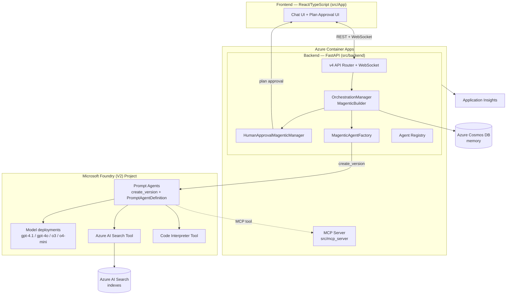

# Implementation Analysis: Multi-Agent Custom Automation Engine (MACAE) Solution Accelerator

**Repository:** [microsoft/Multi-Agent-Custom-Automation-Engine-Solution-Accelerator](https://github.com/microsoft/Multi-Agent-Custom-Automation-Engine-Solution-Accelerator)
**Latest release analyzed:** v4.2.4 (`main` branch, "v4" backend generation)
**Report date:** June 26, 2026
**Verified against:** Microsoft Learn (Foundry Agent Service, Microsoft Agent Framework) — links inline

> ⚠️ **Headline finding:** This accelerator is built on the **next-generation Microsoft Foundry (V2) "new agents developer experience"** (`azure-ai-projects` 2.x, `create_version()` + `PromptAgentDefinition`) and the **Microsoft Agent Framework** orchestration stack. Several core building blocks are **Release Candidate**, **beta**, or **experimental/preview** — they are not yet GA. See [Section 6 — Preview / Pre-GA Feature Flags](#6-preview--pre-ga-feature-flags).

---

## 1. Executive Summary

The Multi-Agent Custom Automation Engine (MACAE) is an AI-driven orchestration system that coordinates a *team* of specialized AI agents to plan, execute, and validate complex business tasks from a single natural-language request. A user submits a goal; a **Magentic manager** decomposes it into a plan, requests **human approval**, then dynamically routes subtasks to specialized agents until the goal is satisfied.

| Aspect | Implementation |
|--------|----------------|
| **Orchestration pattern** | Magentic (Magentic-One style dynamic planning) via Microsoft Agent Framework |
| **Agent runtime** | Microsoft Foundry Agent Service (V2) — server-side "prompt agents" created with `create_version()` |
| **Backend** | Python 3.11, FastAPI, async, WebSocket streaming |
| **Frontend** | React + TypeScript (`src/App`) |
| **Tools / MCP** | Standalone MCP server (`src/mcp_server`) + Azure AI Search (RAG) + server-side Code Interpreter |
| **State / memory** | Azure Cosmos DB (`memory` container) |
| **Hosting** | Azure Container Apps + Azure Container Registry |
| **Observability** | Azure Monitor / Application Insights + OpenTelemetry |
| **IaC** | Bicep (`infra/`), deployable via `azd` (≥ 1.18.0) |
| **Languages** | Python 65%, TypeScript 17.7%, Bicep 8.5%, Shell/PowerShell ~5% |

---

## 2. Solution Architecture



### Repository layout

```text
├── infra/                    # Bicep IaC (main.bicep, modules/, scripts/, WAF variant)
├── src/
│   ├── App/                  # React + TypeScript frontend
│   ├── backend/              # FastAPI backend (Python)
│   │   ├── app.py            # ASGI entrypoint, lifespan, telemetry, CORS, health
│   │   ├── common/           # config, models, database, services
│   │   ├── auth/  middleware/ tests/
│   │   └── v4/               # ← current ("v4") agent generation
│   │       ├── api/          # FastAPI router (app_v4)
│   │       ├── config/       # agent_registry, settings
│   │       ├── magentic_agents/    # agent templates + factory
│   │       ├── orchestration/      # Magentic orchestration + human approval
│   │       ├── callbacks/    # streaming response handlers
│   │       └── models/       # message/data models
│   └── mcp_server/           # Standalone MCP tool server
├── tests/e2e-test/           # Playwright/E2E
├── azure.yaml                # azd service definitions
└── docs/                     # Deployment & architecture guides
```

> The `v4` folder name reflects the backend's migration history (v3 → v4) when it was re-platformed from **Semantic Kernel** onto the **Microsoft Agent Framework**. Comments throughout the code explicitly note replacements like *"This replaces AzureChatCompletion from SK."*

---

## 3. Backend Implementation Deep-Dive

### 3.1 Application bootstrap (`app.py`)

- **FastAPI** app with an async `lifespan` context manager.
- On **shutdown**, calls `agent_registry.cleanup_all_agents()` to delete server-side Foundry agents — important because every run creates real, server-side agent versions in the Foundry project that must be garbage-collected.
- **Telemetry:** `configure_azure_monitor(..., enable_live_metrics=True)` + `FastAPIInstrumentor` (OpenTelemetry), with WebSocket URLs excluded to reduce noise.
- **CORS** is wide open (`allow_origins=["*"]`) — flagged as dev-only in the code; see [Section 7](#7-security--operational-observations).
- Routers mounted from `v4.api.router.app_v4`.

### 3.2 Agent creation — the Foundry V2 surface (`v4/magentic_agents/foundry_agent.py`)

This is the most important file for understanding the platform dependency. `FoundryAgentTemplate` (extends an `AzureAgentBase` lifecycle) builds agents two ways:

**(a) Azure AI Search (RAG) path — server-side prompt agent**

```python
from azure.ai.projects.models import (
    PromptAgentDefinition, AzureAISearchTool,
    AzureAISearchToolResource, AISearchIndexResource,
)

azure_agent = await self.project_client.agents.create_version(
    agent_name=self.agent_name,
    definition=PromptAgentDefinition(
        model=self.model_deployment_name,
        instructions=enhanced_instructions,
        tools=[AzureAISearchTool(
            azure_ai_search=AzureAISearchToolResource(
                indexes=[AISearchIndexResource(
                    project_connection_id=connection_name,
                    index_name=index_name,
                    query_type=query_type,
                    top_k=top_k,
                )])
        )],
    ),
)
# Wrapped in an Agent Framework client by name + version:
chat_client = AzureAIClient(
    project_endpoint=self.project_endpoint,
    agent_name=azure_agent.name,
    agent_version=azure_agent.version,
    ...
)
```

✅ **Verified against Microsoft Learn:** `project.agents.create_version()` with a `PromptAgentDefinition` is exactly the **"new agents developer experience"** in Foundry Agent Service — see [Migrate to the new agents developer experience](https://learn.microsoft.com/azure/foundry/agents/how-to/migrate#migrate-classic-agents-to-new-agents) and [Quickstart: Create a prompt agent](https://learn.microsoft.com/azure/foundry/agents/quickstarts/prompt-agent). This is the **V2** server-side, *versioned* agent model (agents are immutable name+version snapshots).

**(b) MCP / Code-Interpreter path**

- Tools collected dynamically; an **MCP tool** (from the base class) is appended when `use_mcp` is set.
- A code comment documents an API churn point: **`HostedCodeInterpreterTool` was removed in `rc4`** — Code Interpreter is now "handled server-side by `AzureAIClient`." This is direct evidence the project is tracking a **pre-GA, fast-moving SDK**.
- Agents are assembled with `agent_framework.Agent` + `ChatOptions(store=False, tool_choice=...)`.

**Mode selection / constraints (`magentic_agent_factory.py`):**
- Agents are defined declaratively in JSON team configs (stored in Cosmos DB). Capabilities are opt-in flags: `use_rag`, `use_mcp`, `coding_tools`, `use_bing`, `use_reasoning`.
- A `ProxyAgent` represents the **human/user** participant (used for clarifications).
- Reasoning models (`o3`, `o4-mini`) are validated to **not** combine with Bing or coding tools.
- `SUPPORTED_MODELS` is config-gated (e.g. `["o3","o4-mini","gpt-4.1","gpt-4.1-mini"]`).

### 3.3 Orchestration — Magentic (`v4/orchestration/orchestration_manager.py`)

```python
from agent_framework_orchestrations import MagenticBuilder
from agent_framework_orchestrations._magentic import MagenticProgressLedger

builder = MagenticBuilder(
    participants=participant_list,
    manager=manager,                      # HumanApprovalMagenticManager
    checkpoint_storage=InMemoryCheckpointStorage(),
    max_round_count=...,
    max_stall_count=3,
    intermediate_outputs=True,            # stream agent token updates
)
workflow = builder.build()
async for event in workflow.run(task_text, stream=True):
    ...
```

- Uses the **Magentic** orchestration: a manager LLM builds a **task ledger** + **progress ledger**, then selects the next agent each round until `is_request_satisfied`.
- Per-user workflows are cached and rebuilt on team switch / new task; agents are closed and recreated to avoid state bleed.
- Streams `GroupChatRequestSentEvent` / `GroupChatResponseReceivedEvent` / `output` events back to the UI over WebSocket, buffering per-agent tokens into complete `AGENT_MESSAGE`s.
- Notable production hardening (all symptomatic of pre-GA churn):
  - **429/TPM mitigation:** `HumanApprovalMagenticManager._complete()` overrides the base manager to pass `session=None`, making each manager LLM call *stateless* — a deliberate workaround because `rc4`'s `InMemoryHistoryProvider` auto-injects `previous_response_id` chaining that grew payloads and "burned through TPM quota (429)."
  - **Exponential-backoff retry** on `openai.RateLimitError`.
  - **Custom progress-ledger guards** to stop the orchestrator prematurely declaring success before all planned agents have responded, and to prevent re-calling the same agent.

### 3.4 Human-in-the-loop (`v4/orchestration/human_approval_manager.py`)

`HumanApprovalMagenticManager(StandardMagenticManager)` overrides:
- `plan()` — after the manager drafts a plan, it serializes an `MPlan`, sends a `PLAN_APPROVAL_REQUEST` over WebSocket, and **blocks on user approval** before any execution.
- `replan()`, `create_progress_ledger()`, `prepare_final_answer()` — add WebSocket events, max-round termination, and premature-satisfaction guards.
- ✅ Aligns with the documented Agent Framework **Magentic human plan-review** HITL pattern ([Magentic orchestration docs](https://learn.microsoft.com/agent-framework/workflows/orchestrations/magentic)).

### 3.5 Tools / MCP server (`src/mcp_server`)

- A separate deployable MCP server exposing demo tools ("greeting, HR, and planning tools" per `.env.sample`: `MCP_SERVER_NAME=MacaeMcpServer`).
- Agents reach it via the Agent Framework MCP tool (`mcp==1.27.0`). Default local endpoint `http://localhost:9000/mcp`.

### 3.6 Persistence & messaging

- **Azure Cosmos DB** (`azure-cosmos==4.15.0`) — database `macae`, container `memory`; stores team configs, plans, and conversation/memory context (`DatabaseFactory` / `DatabaseBase`).
- **WebSocket** message types: `PLAN_APPROVAL_REQUEST/RESPONSE`, `AGENT_MESSAGE`, `FINAL_RESULT_MESSAGE`, `ERROR_MESSAGE`, `TIMEOUT_NOTIFICATION`.

---

## 4. Frontend

- `src/App` — React + TypeScript single-page chat application (CSS ~3%).
- Renders streamed agent messages, the plan-approval gate, and final results delivered over the backend WebSocket.

---

## 5. Infrastructure & Deployment

| Layer | Detail |
|-------|--------|
| **IaC** | `infra/main.bicep` (+ `main.json`, `modules/`, `scripts/`), with a separate **WAF-hardened** variant (`main.waf.parameters.json`) and `main_custom.bicep` |
| **Provisioning** | Azure Developer CLI (`azd` ≥ **1.18.0**); Bicep CLI ≥ **0.33.0** for local builds |
| **Compute** | Azure Container Apps (frontend + backend + MCP server containers) |
| **Registry** | Azure Container Registry (fixed daily cost) |
| **AI** | Microsoft Foundry resource/project + Azure OpenAI model deployments; Azure AI Search for RAG |
| **Data** | Azure Cosmos DB |
| **Secrets** | Azure Key Vault; **Managed Identity** for resource-to-resource auth |
| **Networking** | Optional WAF + App Gateway / VNet hardening |
| **CI/CD** | GitHub Actions (`.github/`) + Azure DevOps pipelines (`.azdo/pipelines`); `deploy-v2.yml` |
| **Region requirements** | Regions with Azure OpenAI + Azure AI Search + Semantic Search (e.g. East US2, Sweden Central, UK South, Australia East) |

**Model deployments observed** (`.env.sample`): `gpt-4.1`, `gpt-4.1-mini`, `gpt-4o`, plus reasoning models `o3` / `o4-mini`. API version `2024-12-01-preview`.

---

## 6. Preview / Pre-GA Feature Flags

This is the section you specifically asked for. Each item below is the result of cross-checking the pinned dependency versions and source code against current Microsoft Learn documentation.

### 🔴 6.1 Microsoft Agent Framework — Orchestrations are **EXPERIMENTAL**

- **Package:** `agent-framework-orchestrations==1.0.0b260311` (**beta**).
- **Used for:** the entire `MagenticBuilder` orchestration, `StandardMagenticManager`, `MagenticProgressLedger`, and imports from **private modules** (`agent_framework_orchestrations._magentic`, `._base_group_chat_orchestrator`).
- **Microsoft documentation status:**
  > *"Agent Orchestration features in the Agent Framework are in the **experimental** stage. They are under active development and may change significantly before advancing to the preview or release candidate stage."*
  — [Magentic Orchestration (Agent Framework)](https://learn.microsoft.com/agent-framework/workflows/orchestrations/magentic)
- **Risk:** Highest. The orchestration is the heart of the solution, it is *experimental*, and the code imports **underscore-prefixed private APIs** that carry no compatibility guarantee.

### 🔴 6.2 Microsoft Agent Framework core/provider — **Release Candidate**

- **Packages:** `agent-framework-core==1.0.0rc4`, `agent-framework-azure-ai==1.0.0rc4`.
- **Evidence of churn:** code comment *"`HostedCodeInterpreterTool` was removed in rc4"*; manager workarounds for `rc4` history/session behavior.
- **Naming note:** the repo uses `AzureAIClient` (from `agent_framework_azure_ai`). Microsoft's **refreshed** Foundry preview renames this to **`FoundryChatClient`** (`agent_framework.foundry`) and splits packages (`agent-framework-foundry`, `-foundry-hosting`). The accelerator therefore targets the **earlier preview surface** of the Agent Framework Foundry provider. — [Migrate hosted agents to the refreshed public preview](https://learn.microsoft.com/azure/foundry/agents/how-to/migrate-hosted-agent-preview).
- **Risk:** High — RC APIs can still change before 1.0 GA.

### 🟠 6.3 Foundry V2 "new agents developer experience" — `azure-ai-projects` 2.x

- **Package:** `azure-ai-projects==2.1.0` (the **2.x / V2** line).
- **Used for:** `project_client.agents.create_version(...)` with `PromptAgentDefinition`, `AzureAISearchTool`, `AzureAISearchToolResource`, `AISearchIndexResource`.
- **Status:** This is the current **Foundry (V2)** agent model. Prompt agents and the versioned `create_version` API are documented as the *new* developer experience that replaces classic Assistants/Agents. The .NET sibling library is published as **`2.0.0-beta.1`** and adjacent capabilities (Hosted Agents, declarative agents) are explicitly flagged **preview** (e.g. the `AAIP001` preview warning). — [Quickstart: Create a prompt agent](https://learn.microsoft.com/azure/foundry/agents/quickstarts/prompt-agent), [Azure AI Projects for .NET 2.0.0](https://learn.microsoft.com/dotnet/api/overview/azure/ai.projects.agents-readme).
- **Risk:** Medium — this is the strategic forward path, but it is a 2.x SDK whose surface is still settling.

### 🟠 6.4 `azure-ai-inference` — **beta**

- **Package:** `azure-ai-inference==1.0.0b9` (beta). Per current Foundry guidance this client is being superseded by the `OpenAI()`/Responses pattern (`openai==2.33.0` is also a dependency).
- **Risk:** Medium — beta + on a deprecation path.

### 🟡 6.5 Azure OpenAI API version `2024-12-01-preview`

- `.env.sample` pins `AZURE_OPENAI_API_VERSION=2024-12-01-preview` — a **preview** REST API version.
- **Risk:** Low–Medium — preview API versions can be retired.

### 🟡 6.6 Reasoning models (`o3`, `o4-mini`) & `gpt-4.1` family

- Used as first-class deployment targets. Availability/quota varies by region and these are newer model families; the code special-cases reasoning models (no Bing/coding tools, no temperature).
- **Risk:** Low (capability/quota dependent rather than API-stability).

### ✅ Not used (worth noting)
- **Foundry Hosted Agents (preview):** The solution uses **prompt agents** (server-side, fully managed) — *not* the preview **Hosted Agents** container model. It self-hosts its own containers on Azure Container Apps instead.
- **Foundry IQ / agentic-retrieval knowledge bases:** RAG is wired through the **classic Azure AI Search tool** on the prompt-agent definition, not through a Foundry IQ knowledge base.

### Preview-surface summary

| # | Feature / dependency | Version | Status per MS Learn | Risk |
|---|----------------------|---------|---------------------|:----:|
| 6.1 | Agent Framework **Orchestrations** (Magentic) | `1.0.0b260311` | **Experimental** | 🔴 |
| 6.2 | Agent Framework core + Azure AI provider | `1.0.0rc4` | **Release Candidate** | 🔴 |
| 6.3 | Foundry V2 prompt agents (`create_version`) | `azure-ai-projects 2.1.0` | New experience; 2.x/beta-adjacent | 🟠 |
| 6.4 | `azure-ai-inference` | `1.0.0b9` | **Beta** / superseded | 🟠 |
| 6.5 | Azure OpenAI REST API version | `2024-12-01-preview` | **Preview** | 🟡 |
| 6.6 | `o3` / `o4-mini` / `gpt-4.1` models | n/a | Newer model families | 🟡 |

---

## 7. Security & Operational Observations

| Area | Observation |
|------|-------------|
| **Identity** | Managed Identity for Azure resource access; Key Vault for connection secrets — good practice. |
| **CORS** | `allow_origins=["*"]` with `allow_credentials=True` in `app.py` — explicitly commented as dev-only; **must be restricted** before production (wildcard + credentials is an anti-pattern). |
| **Agent cleanup** | Server-side agent versions are created per run and deleted on close/shutdown — necessary to avoid orphaned Foundry agents accumulating in the project. |
| **Rate-limiting resilience** | Strong: stateless manager calls, exponential backoff, and round/stall caps mitigate TPM exhaustion. |
| **Network hardening** | A WAF-supported deployment variant exists for tenants with restricted public network access. |
| **Quota** | Deployment requires an explicit Azure OpenAI quota check (`docs/quota_check.md`). |
| **Responsible AI** | Ships transparency/RAI FAQ; English-only; synthetic data; proof-of-concept disclaimer. |

---

## 8. Key Takeaways & Recommendations

1. **Forward-looking but pre-GA.** The accelerator is a faithful reference for the *new* Microsoft AI agent stack — **Microsoft Agent Framework + Foundry V2 prompt agents** — but its two most load-bearing dependencies (orchestrations, framework core) are **experimental** and **release-candidate** respectively. Treat it as a **proof-of-concept / learning reference**, not a production-ready base, until those reach GA.
2. **Pin and watch.** Because it imports private modules (`agent_framework_orchestrations._magentic`) and works around `rc4`-specific behavior, minor dependency bumps can break it. Keep versions pinned (as the repo does) and budget for migration as the Agent Framework moves rc4 → GA and the Foundry provider renames `AzureAIClient` → `FoundryChatClient`.
3. **Production checklist before adopting:** lock down CORS, validate region/model quota, enable Defender for Cloud + VNet/WAF, review Cosmos/Key Vault RBAC, and add eval/guardrails (the solution focuses on orchestration, not content safety/evaluation).
4. **Architecture is reusable.** The pattern — JSON-defined agent teams in Cosmos DB → Magentic planning → human approval gate → streamed multi-agent execution → server-side Foundry tools (AI Search, Code Interpreter, MCP) — is a clean, transferable blueprint regardless of the specific SDK versions.

---

## 9. References (Microsoft Learn — verified June 2026)

| Topic | Link |
|-------|------|
| Migrate to the new agents developer experience (`create_version` + `PromptAgentDefinition`) | https://learn.microsoft.com/azure/foundry/agents/how-to/migrate |
| Quickstart: Create a prompt agent | https://learn.microsoft.com/azure/foundry/agents/quickstarts/prompt-agent |
| What is Microsoft Foundry Agent Service? (agent types) | https://learn.microsoft.com/azure/foundry/agents/overview |
| Magentic orchestration (Agent Framework) — *experimental* | https://learn.microsoft.com/agent-framework/workflows/orchestrations/magentic |
| Microsoft Agent Framework Workflows | https://learn.microsoft.com/agent-framework/workflows/ |
| Migrate hosted agents to refreshed preview (`AzureAIClient` → `FoundryChatClient`) | https://learn.microsoft.com/azure/foundry/agents/how-to/migrate-hosted-agent-preview |
| Hosted agents (preview) concepts | https://learn.microsoft.com/azure/foundry/agents/concepts/hosted-agents |
| AI agent orchestration patterns | https://learn.microsoft.com/azure/architecture/ai-ml/guide/ai-agent-design-patterns |
| Azure AI Projects client library (.NET 2.0.0) | https://learn.microsoft.com/dotnet/api/overview/azure/ai.projects.agents-readme |

---

*Analysis based on the `main` branch (release v4.2.4). All preview/GA status claims were verified against Microsoft Learn on the report date; Foundry and Agent Framework are evolving rapidly, so re-verify status before any production decision.*
