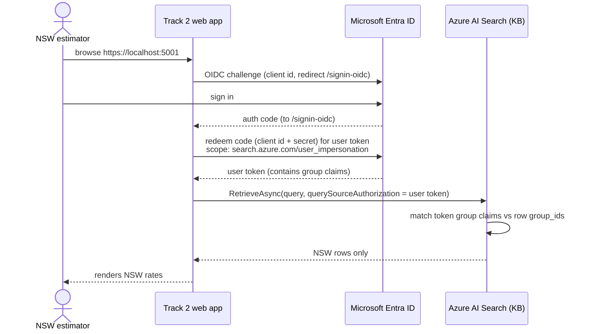

# Step 4 · Track 2 — Identity-Native Row-Level Security (Recommended)

> **📍 Step 4 of 4 · RLS — the recommended, working option** · [🧭 Overview](00-foundry-iq-azure-sql-rls.md) · ⬅ Prev: [Step 2 · SQL knowledge source](02-foundry-iq-azure-sql.md) · ↔ Reference-only alternative: [Step 3 · Track 1](03-foundry-iq-rls-security-filter.md)

**Version:** 1.0
**Last Updated:** July 2026
**Format:** App-led demo
**Prerequisites:** [Setup](01-foundry-iq-azure-sql-setup.md) + [Base SQL knowledge source](02-foundry-iq-azure-sql.md)

> ⚠️ **Preview feature** — uses the `2026-05-01-preview` API and preview SDK
> packages. Not for production. Restricts rate rows by the **signed-in user's
> Microsoft Entra identity** — no filter logic in the app.

---

## Objective

A user in the `grp-estimating-nsw` Entra group automatically sees **only** NSW
rate rows; a user in `grp-estimating-vic` sees **only** VIC rows. Enforcement
happens inside Azure AI Search based on the user's token — the app passes the
token through and writes no filter.

```
User signs in (Entra) ─► app gets user token (scope: search.azure.com)
                     ─► retrieve(x-ms-query-source-authorization = user token)
                     ─► Search trims rows by permission filter vs user's groups
                     ─► only the user's region rows come back
```

---

## Why the Azure SQL source alone can't do this

- The Azure SQL knowledge source (`indexedSql`) does **not** support
  `ingestionPermissionOptions` — only Blob/ADLS Gen2, OneLake and indexed
  SharePoint ingest permission metadata natively.
- Azure SQL's own Row-Level Security does **not** propagate: the generated
  indexer reads every row under one connection identity.

So we build a **push-model index with permission filters**: each rate row is
tagged with the Entra **group object id(s)** that may see it, and the index has a
`permissionFilter` field. At query time, Azure AI Search compares the user's
Entra claims to that field and trims the results.

---

## Build the permission-filtered index

1. Create an index with a **group-ids permission filter** field, e.g.
   `group_ids` typed `Collection(Edm.String)` with
   `permissionFilter: "groupIds"`, and enable permission filtering on the index
   (`permissionFilterOption`). Requires the `2026-05-01-preview` REST API / preview SDK.
2. **Push** the rate rows into the index (do **not** use the SQL auto-indexer for
   this track). For each row, set `group_ids` to the Entra **group object id**
   that matches its `owner_group` value:

   | `owner_group` (SQL) | Entra group | `group_ids` value |
   |---|---|---|
   | `grp-estimating-nsw` | Estimating - NSW | `<NSW group object id>` |
   | `grp-estimating-vic` | Estimating - VIC | `<VIC group object id>` |

   Read the rows from `dbo.rate_library` and map `owner_group` → group id using
   the ids recorded during [setup step 5](01-foundry-iq-azure-sql-setup.md#5-entra-security-groups--test-users-personas).
3. Wrap the index as a `searchIndex` knowledge source
   `ks-rate-library-secured` and add it to a knowledge base.

> **The index must have a semantic configuration.** A Foundry IQ `searchIndex`
> knowledge source requires one — without it the portal greys the index out as
> *"missing semantic configuration"* and you can't add it. The seeder below
> creates a `rate-semantic` configuration over `content_text` automatically.

> The consuming app includes a one-time `--seed-index` mode that creates the
> index (with permission filter **and** semantic config) and pushes the
> permission-tagged rows for you (see below).

---

## The consuming app

Location: [`../src/track2-identity-rls`](../src/track2-identity-rls)

An ASP.NET web app that:

1. Signs the user in with **Microsoft.Identity.Web** (OpenID Connect).
2. Acquires a token for `https://search.azure.com/.default` on the user's behalf.
3. Calls `KnowledgeBaseRetrievalClient.RetrieveAsync(request, querySourceAuthorization: userToken)`.
4. Renders the returned rows — **no filter logic**; Search trims by identity.

> **Retrieval settings that matter for a clean demo:**
> - The knowledge base's **retrieval reasoning effort** must be **`low`** (or
>   higher), not `minimal`. With `minimal`, the retrieve API rejects `messages`
>   input (*"Messages input not supported when 'minimal' reasoning effort is
>   requested"*) and requires `intents` instead. `low` also needs a model on the
>   knowledge base for query planning.
> - Agentic retrieval is **relevance-ranked**, so a broad "list all my rows"
>   query returns only the top matches by default. The app sets
>   `SearchIndexKnowledgeSourceParams.MaxOutputDocuments` (e.g. 50) and
>   `RerankerThreshold = 0` to return every identity-trimmed row, not just the
>   single best match. Filtering by identity still happens regardless.

Configure `appsettings.json` (or user-secrets) with the tenant id, client id,
client secret, redirect URI, search endpoint and knowledge base name from
[setup](01-foundry-iq-azure-sql-setup.md).

Seed the secured index once, then run the web app:

```powershell
cd ../src/track2-identity-rls
dotnet run -- --seed-index      # one-time: create index + push permission-tagged rows
dotnet run                      # start the web app, browse https://localhost:5001
```

**Expected:** sign in as the NSW test user → only NSW rates. Sign out, sign in as
the VIC test user → only VIC rates. The query and app code are identical for both;
only the identity differs.

---

## How it connects at runtime

The end-to-end flow ties together the **app registration** (setup §6), the
signed-in **user**, and Azure AI Search's **permission-filter** enforcement:

```
User → signs in via the app registration (OIDC, redirect /signin-oidc)
     → app redeems the auth code using its client id + client secret
     → app requests the delegated scope https://search.azure.com/user_impersonation
     → Entra issues a USER token whose audience is Azure AI Search
     → app calls RetrieveAsync(request, querySourceAuthorization: userToken)
     → Search reads the user's Entra group claims from the token
     → Search compares them to each row's group_ids permission-filter field
     → only rows the user's groups may access are returned
```

As a sequence:



Key point: the app writes **no filter**. The only thing that changes between the
NSW and VIC users is the identity in the token — Search does the trimming.

---

## Can this run through a Foundry agent? (No — important)

The natural question is *"can an NSW estimator just chat a Foundry agent and get
NSW-only data?"* In the current preview, **no**:

- A Foundry Agent Service agent calls the knowledge base with the **project's
  managed identity**, not the chatting user's token.
- [Per-request headers for MCP tools aren't supported](https://learn.microsoft.com/azure/foundry/agents/how-to/foundry-iq-connect)
  — *"headers set in agent definitions apply to all invocations and can't vary by
  user or request"* — so `x-ms-query-source-authorization` can't carry each user's
  token. Against a permission-filtered index, the agent's identity matches no
  `group_ids`, so it gets **nothing back**.

> **For per-user authorization, use the Azure OpenAI Responses API** (Microsoft's
> documented path) or the **app-mediated retrieve** shown here — both inject the
> user token per request. This Track 2 app is the app-mediated pattern.

---

## Security notes

- **Identity-native.** Enforcement uses the user's Entra claims against the
  index permission metadata — the app cannot widen access by changing a filter.
- **Group-based.** Prefer group ids over user ids for manageability.
- **Sync lag.** Permission/membership changes take time to reflect; changes made
  outside `2026-05-01-preview` may lag in preview retrieval results.
- **Preview constraints.** Single-tenant, RBAC auth; preview SDK packages only.

---

## Track 1 vs Track 2 recap

| | Track 1 (security filter) | Track 2 (this — recommended) |
|---|---|---|
| Status | Concept-only reference (no code) | ✅ Shipped, working |
| Enforcement | App-side OData filter | Entra token + permission filters |
| App writes filter? | Yes (from user claims) | No |
| Identity-native? | No | Yes |
| Runs through a Foundry agent? | No | No — app-mediated retrieve or Responses API |
| Ingestion | SQL auto-indexer (wrapped) | Push model (permission-tagged) |

---

## References

| Resource | Link |
|----------|------|
| Enforce permissions at query time | https://learn.microsoft.com/azure/search/agentic-retrieval-how-to-retrieve |
| Document-level access control | https://learn.microsoft.com/azure/search/search-document-level-access-overview |
| Query-time ACL / RBAC enforcement | https://learn.microsoft.com/azure/search/search-query-access-control-rbac-enforcement |
| Push-model permissions quickstart | https://github.com/Azure-Samples/azure-search-python-samples/blob/main/Quickstart-Document-Permissions-Push-API |
| Microsoft.Identity.Web | https://learn.microsoft.com/entra/msal/dotnet/microsoft-identity-web/ |
