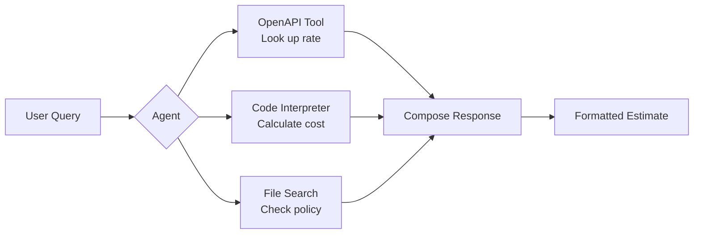

# Module 5: Foundry Toolkit & Data Connectors (45 min)

**Objective:** Connect agents to enterprise data sources and external tools using the Foundry tool catalog.

**Topics:**

- Tool ecosystem overview (1,400+ tools)
- Built-in tools: File Search, Code Interpreter, Web Search, Image Generation
- MCP (Model Context Protocol) — connect to MCP-compatible servers
- Azure AI Search — enterprise search integration
- Microsoft Fabric / Fabric IQ — structured data queries
- Azure Functions — serverless actions
- OpenAPI — custom REST APIs
- A2A (Agent-to-Agent) — multi-agent collaboration

**Demo:** Connect Code Interpreter (cost calculations) + OpenAPI tool (mock pricing API) to the Contoso Estimator agent and show multi-tool orchestration.

> **Pro-code equivalent:** See Module 11, Step 5 (`Step05_AddTools.cs`)

**Reference:** [Tool Catalog](https://learn.microsoft.com/azure/foundry/agents/concepts/tool-catalog) | [Fabric IQ](https://learn.microsoft.com/azure/foundry/agents/how-to/tools/fabric-iq)

---

## Prerequisites

| # | Requirement | Details |
|---|-------------|---------|
| 1 | Completed Module 2 | Contoso Estimator Advisor agent created with File Search + Code Interpreter |
| 2 | Foundry project access | Foundry User role or higher on the project |
| 3 | Sample OpenAPI spec | `data/sample-openapi-spec.yaml` (included in this module) |

---

## Concepts

### What Are Tools?

A *tool* is a capability that an agent can invoke during a conversation to perform a specific task. When an agent receives a user message, the Foundry model decides whether to call a tool based on the agent's instructions and the available tool definitions. The agent sends the tool request, the service executes it, and the result flows back into the conversation so the agent can continue with accurate, up-to-date information.

### Types of Tools

Foundry Agent Service provides two categories of tools:

| Category | Description | Examples |
|----------|-------------|----------|
| **Built-in tools** | Pre-configured capabilities. Enable on an agent and the service handles execution. No external hosting required. | Web Search, Code Interpreter, File Search, Image Generation |
| **Custom tools** | Extend agents with your own APIs, services, or other agents. | OpenAPI, MCP, Azure Functions, A2A |

### Built-in Tools

| Tool | What It Does |
|------|-------------|
| [Web Search](https://learn.microsoft.com/azure/foundry/agents/how-to/tools/web-search) | Retrieve real-time information from the public web with inline citations |
| [Code Interpreter](https://learn.microsoft.com/azure/foundry/agents/how-to/tools/code-interpreter) | Write and run Python code in a sandboxed environment for data analysis, math, and charts |
| [File Search](https://learn.microsoft.com/azure/foundry/agents/how-to/tools/file-search) | Augment agents with knowledge from uploaded files using vector search |
| [Image Generation](https://learn.microsoft.com/azure/foundry/agents/how-to/tools/image-generation) | Generate images from text descriptions using DALL-E or GPT-image models |
| [Function Calling](https://learn.microsoft.com/azure/foundry/agents/how-to/tools/function-calling) | Define custom functions the agent can call; your app executes the function and returns the result |

### Custom Tools and Connectors

| Tool | When to Use |
|------|-------------|
| [MCP (Model Context Protocol)](https://learn.microsoft.com/azure/foundry/agents/how-to/tools/model-context-protocol) | Connect to tools hosted on an MCP server endpoint — best for tools shared across agents or maintained by a different team |
| [OpenAPI](https://learn.microsoft.com/azure/foundry/agents/how-to/tools/openapi) | Connect to external HTTP APIs using an OpenAPI 3.0 or 3.1 specification |
| [Azure AI Search](https://learn.microsoft.com/azure/foundry/agents/how-to/tools/azure-ai-search) | Enterprise search over structured and unstructured data with vector, keyword, and hybrid retrieval |
| [Fabric IQ](https://learn.microsoft.com/azure/foundry/agents/how-to/tools/fabric-iq) | Query structured enterprise data in Microsoft Fabric using natural language (preview) |
| [Azure Functions](https://learn.microsoft.com/azure/foundry/agents/how-to/tools/azure-functions) | Run serverless code triggered by agent tool calls |
| [A2A (Agent-to-Agent)](https://learn.microsoft.com/azure/foundry/agents/how-to/tools/agent-to-agent) | Connect agents to other agents through A2A-compatible endpoints (preview) |

### Toolbox (Preview)

A *toolbox* is a curated bundle of tools — such as web search, Azure AI Search, Code Interpreter, MCP servers, and OpenAPI tools — configured once and exposed as a single MCP-compatible endpoint. Instead of attaching each tool individually, define the collection in a toolbox and connect any agent to the toolbox endpoint. Toolboxes support versioning and centralized authentication management.

> **Reference:** [Create and use a Foundry Toolbox](https://learn.microsoft.com/azure/foundry/agents/how-to/tools/toolbox)

### Tool Authentication

| Tool Type | Auth Options |
|-----------|-------------|
| Built-in (Code Interpreter, File Search) | Automatic — no configuration needed |
| Data connectors (AI Search, SharePoint) | Project connections configured in Foundry portal |
| MCP servers | API key, Microsoft Entra ID (managed identity), or OAuth |
| OpenAPI tools | Anonymous, API key, or managed identity |

---

## Contoso Estimator Scenario

In previous modules, the Contoso Estimator Advisor already has:

- **File Search** — rate library and estimation policy PDFs (Module 2)
- **Code Interpreter** — cost calculations from BOQ quantities (Module 2)
- **Foundry IQ** — project history knowledge base (Module 3)

In this module, we extend the agent with an **OpenAPI tool** that connects to the Contoso Pricing API. This gives the agent access to live, up-to-date unit rates instead of relying solely on the static rate library PDF.

### Multi-Tool Orchestration

When the agent receives a query like *"Estimate earthworks costs for 2,400 m³ of bulk excavation in Sydney"*, it can:

1. **OpenAPI tool** → look up the current unit rate for earthworks labour in the Sydney region
2. **Code Interpreter** → calculate total cost: `2,400 m³ × $85.50/hr = $205,200`
3. **File Search** → verify against the company's margin guidelines from the estimation policy
4. **Combine results** → return a formatted estimate with rate source, calculation, and policy compliance

---

## Pre-Demo Setup Checklist

| # | Task | How | Verify |
|---|------|-----|--------|
| 1 | Confirm Contoso Estimator agent exists | Open Foundry portal → your project → **Build** → **Agents** | Agent `contoso-estimator-advisor` is listed |
| 2 | Confirm Code Interpreter is enabled | Open agent → **Tools** tab | Code Interpreter appears in the tool list |
| 3 | Prepare OpenAPI spec file | Download `data/sample-openapi-spec.yaml` from this module to your local machine | File is accessible for upload |
| 4 | Open Tool Catalog page in a browser tab | Navigate to Foundry portal → project → **Build** → **Tools** | Tool catalog page loads with categories visible |
| 5 | Prepare demo queries | Copy the sample queries from the Demo Walkthrough section below | Queries are ready to paste during the demo |

---

## Demo Walkthrough (Portal-Led)

### Part 1 — Explore the Tool Catalog (10 min)

1. **Open the Tool Catalog**
   - In the Foundry portal, navigate to your project
   - Select **Build** → **Tools** to open the tool catalog
   - Browse the categories: Built-in, MCP, OpenAPI, Connectors

2. **Highlight key tools**
   - Point out the built-in tools already attached to the agent (File Search, Code Interpreter)
   - Show the MCP category — call out that this allows connecting to any MCP-compatible server
   - Show the OpenAPI category — this is what we will configure next
   - Mention A2A (preview) for multi-agent collaboration scenarios

3. **Discuss enterprise connectors**
   - **Azure AI Search** — for semantic/hybrid search over enterprise data
   - **Fabric IQ** — for natural language queries against structured data in Microsoft Fabric (preview)
   - **SharePoint** — for grounding agents in organizational documents

### Part 2 — Connect the OpenAPI Tool (15 min)

1. **Navigate to the agent's tool configuration**
   - Open `contoso-estimator-advisor` agent → **Tools** tab

2. **Add an OpenAPI tool**
   - Select **Add tool** → **OpenAPI**
   - Upload or paste the contents of `data/sample-openapi-spec.yaml`
   - Set the tool name: `contoso-pricing-api`
   - Set the description: *"Look up current unit rates and create preliminary cost estimates for Contoso Infrastructure projects"*
   - Configure authentication: select **API Key** and reference the project connection (or use **Anonymous** for the demo)

3. **Review the operations**
   - The portal parses the OpenAPI spec and shows three operations:
     - `list-rates` — list available rate categories
     - `lookup-rate` — look up a specific unit rate
     - `create-estimate` — create a preliminary cost estimate
   - Point out that each operation has an `operationId` — this is required for Foundry to identify the operation

4. **Save and test the configuration**
   - Save the tool configuration
   - The agent now has access to the pricing API alongside its existing tools

### Part 3 — Multi-Tool Orchestration Demo (15 min)

1. **Test Code Interpreter alone**
   - Prompt: *"Calculate the total cost for 500 hours of general labour at $85.50 per hour with a 12.5% margin"*
   - Show the agent using Code Interpreter to perform the calculation
   - Highlight the Python code execution in the response

2. **Test OpenAPI tool**
   - Prompt: *"What is the current unit rate for earthworks labour in the Sydney metro region?"*
   - Show the agent calling the `lookup-rate` operation
   - Point out the tool call in the conversation trace

3. **Test multi-tool orchestration**
   - Prompt: *"I need a preliminary estimate for the Northshore Bridge Approach Road project. We need 2,400 m³ of bulk excavation and 800 m³ of concrete for foundations, all in the Sydney metro region. Apply the standard margin."*
   - The agent should:
     - Call `lookup-rate` to get current rates for earthworks and concrete
     - Use Code Interpreter to calculate line totals and apply the margin
     - Reference the estimation policy (File Search) for the standard margin percentage
   - Highlight how the agent orchestrates multiple tools in a single response

4. **Discuss tool selection**
   - Explain that the model decides which tools to call based on the user's query and the agent's system instructions
   - Show how the system prompt can guide tool selection preferences

### Part 4 — Wrap-Up and Key Takeaways (5 min)

- **Tool catalog** provides 1,400+ tools across built-in and custom categories
- **OpenAPI tools** let you connect agents to any REST API with an OpenAPI spec
- **Multi-tool orchestration** — the model intelligently selects and combines tools
- **Authentication** — supports anonymous, API key, managed identity, and OAuth
- **Toolbox** (preview) — bundle tools into a reusable, versioned MCP endpoint
- Coming up in Module 6: Observability & Tracing — monitor tool calls and agent behaviour

---

## Sample OpenAPI Spec

This module includes `data/sample-openapi-spec.yaml` — a mock Contoso Infrastructure Pricing API with three operations:

| Operation | Method | Path | Description |
|-----------|--------|------|-------------|
| `list-rates` | GET | `/rates` | List available rate categories (labour, plant, materials) |
| `lookup-rate` | GET | `/rates/lookup` | Look up a unit rate by trade, resource type, and region |
| `create-estimate` | POST | `/estimates` | Create a preliminary cost estimate from BOQ line items |

> **Note:** This is a mock API spec for demo purposes. In a real deployment, replace the server URL and authentication with your actual pricing service endpoint.

---

## References

| Topic | Link |
|-------|------|
| Tool Catalog Overview | [Agent tools overview for Foundry Agent Service](https://learn.microsoft.com/azure/foundry/agents/concepts/tool-catalog) |
| OpenAPI Tool | [Connect agents to OpenAPI tools](https://learn.microsoft.com/azure/foundry/agents/how-to/tools/openapi) |
| Code Interpreter | [Code Interpreter tool](https://learn.microsoft.com/azure/foundry/agents/how-to/tools/code-interpreter) |
| MCP Tool | [Model Context Protocol](https://learn.microsoft.com/azure/foundry/agents/how-to/tools/model-context-protocol) |
| Fabric IQ | [Connect agents to Fabric IQ](https://learn.microsoft.com/azure/foundry/agents/how-to/tools/fabric-iq) |
| A2A (Preview) | [Agent-to-Agent communication](https://learn.microsoft.com/azure/foundry/agents/how-to/tools/agent-to-agent) |
| Toolbox (Preview) | [Create and use a Foundry Toolbox](https://learn.microsoft.com/azure/foundry/agents/how-to/tools/toolbox) |
| Tool Authentication | [Set up MCP server authentication](https://learn.microsoft.com/azure/foundry/agents/how-to/mcp-authentication) |
