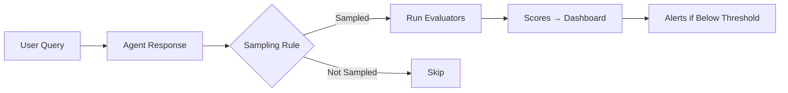

# Module 7: Evaluation & Continuous Monitoring (45 min)

**Objective:** Run batch evaluations, set up continuous monitoring, and integrate into CI/CD.

**Prerequisites:** Module 2 (agent created), Module 6 (Application Insights connected)

---

## Topics

- Offline batch evaluation — test agents against labeled datasets
- Built-in evaluators: task adherence, intent resolution, tool call accuracy, groundedness
- Custom evaluators for domain-specific criteria
- **Continuous evaluation** — auto-evaluate live production traffic
- Evaluation rules and sampling
- LLM-as-judge patterns
- CI/CD integration with GitHub Actions
- Evaluation-driven deployment gates

---

## Concept Overview (10 min)

### Why Evaluate?

Evaluation ensures your agent meets quality and safety standards before deployment. By running evaluations during development, you establish a baseline for your agent's performance and can set acceptance thresholds — for example, an 85% task adherence passing rate — before releasing it to users.

For the **Contoso Estimator Advisor**, evaluation answers questions such as:

- Does the agent return accurate rates from the rate library?
- Are cost calculations correct given BOQ quantities?
- Does the agent correctly reference estimation policies?
- Are responses grounded in the uploaded documents rather than hallucinated?

### Evaluation Approaches

| Approach | When to Use | How It Works |
|----------|-------------|--------------|
| **Batch evaluation** | Pre-deployment testing | Run a dataset of labeled Q&A pairs against the agent, score with evaluators |
| **Continuous evaluation** | Production monitoring | Automatically evaluate a sample of live agent responses in real time |
| **Scheduled evaluation** (preview) | Periodic benchmarking | Run evaluations on a schedule to validate ongoing performance |

### Built-in Evaluators

Microsoft Foundry provides several categories of built-in evaluators:

| Category | Evaluators | What They Measure |
|----------|-----------|-------------------|
| **Agent evaluators** | Task Adherence, Intent Resolution, Tool Call Accuracy | How effectively agents handle tasks, tools, and user intent |
| **Quality evaluators** | Coherence, Fluency, Groundedness, Relevance | Overall quality of generated responses |
| **Safety evaluators** | Violence, Self-Harm, Sexual, Hate/Unfairness | Potential content and security risks in output |
| **Text similarity** | BLEU, ROUGE, F1 Score | Compare generated text against reference answers |

### LLM-as-Judge Pattern

AI-assisted evaluators (such as Task Adherence and Coherence) use a GPT model as a "judge" to score agent responses. The judge model:

1. Receives the original query, the agent's response, and scoring criteria
2. Produces a score (typically 1–5) and a reasoning explanation
3. Compares the score against a threshold to determine pass/fail

This pattern enables nuanced evaluation beyond keyword matching — the judge can assess whether an answer is semantically correct, well-structured, and faithful to source documents.

### Custom Evaluators

For domain-specific criteria — such as whether the Contoso Estimator correctly applies margin guidelines or formats cost breakdowns — you can create custom evaluators. Custom evaluators can be:

- **Code-based** — Python functions that apply rule-based checks
- **Prompt-based** — LLM-as-judge with a custom prompt template

> **Reference:** [Custom Evaluators](https://learn.microsoft.com/azure/foundry/concepts/evaluation-evaluators/custom-evaluators)

---

## Demo: Batch Evaluation in Foundry Portal (20 min)

### Pre-Demo Setup Checklist

| # | Task | How | Verify |
|---|------|-----|--------|
| 1 | Contoso Estimator agent exists | Created in Module 2 with File Search + Code Interpreter | Agent visible in Foundry portal → Agents page |
| 2 | Agent has at least one version | Create or verify a version in the agent's Versions tab | Version number shown on agent detail page |
| 3 | GPT-4.1 (or GPT-4o) model deployed | Foundry portal → Models → Deployments | Deployment name noted for evaluator configuration |
| 4 | Application Insights connected | Connected in Module 6 | Foundry portal → Project Settings → Connected resources |
| 5 | Evaluation dataset prepared | Use `data/contoso-estimator-eval.jsonl` from this module | File contains 10 labeled Q&A pairs in JSONL format |
| 6 | Foundry User role assigned | Azure portal → Foundry project → Access control (IAM) | Current user has Foundry User role |

### Demo Steps

#### Step 1 — Review the Evaluation Dataset

Open `data/contoso-estimator-eval.jsonl` and walk through the structure:

```jsonl
{"query": "What is the standard labor rate for a qualified electrician in the Sydney metro region?", "ground_truth": "The standard labor rate for a qualified electrician in the Sydney metro region is $95 per hour, as specified in the Contoso rate library."}
```

Each line contains:
- **`query`** — The question to send to the agent
- **`ground_truth`** — The expected correct answer (used by evaluators that compare against a reference)

> **Presenter note:** Highlight that these queries span all three data sources the agent has access to — rate library, estimation policy, and project history — giving broad coverage.

#### Step 2 — Create Evaluation in the Foundry Portal

1. Navigate to **Microsoft Foundry** portal → select your project
2. From the left pane, select **Evaluation** → **Create**
3. Alternatively, navigate to your agent → **Evaluation** tab → **Create**

#### Step 3 — Configure the Evaluation

1. **Name:** `contoso-estimator-batch-eval-v1`
2. **Data source:** Upload `contoso-estimator-eval.jsonl`
3. **Target:** Select the `contoso-estimator-advisor` agent
4. **Evaluators:** Select the following:
   - **Task Adherence** — Does the agent follow its system instructions?
   - **Groundedness** — Are responses grounded in the uploaded documents?
   - **Coherence** — Are responses logical and well-structured?
   - **Relevance** — Are responses relevant to the query?

#### Step 4 — Run the Evaluation

1. Select **Run** to start the batch evaluation
2. The service sends each query to the agent, captures responses, and scores them
3. Evaluation typically completes in 2–5 minutes for 10 queries

#### Step 5 — Review Results

Walk through the results in the portal:

- **Summary view** — Aggregated pass/fail counts per evaluator
- **Per-row results** — Individual scores with reasoning for each query
- **Report URL** — Shareable link to the full evaluation report

> **Key talking point:** Show a failed evaluation result and explain the reasoning the judge model provides. This transparency helps teams understand *why* an answer was scored low, not just that it failed.

---

## Continuous Evaluation (10 min)

### Concept

Continuous evaluation runs evaluators automatically on a sample of live production traffic. Rather than testing once before deployment, it provides ongoing quality monitoring.



### How It Works

1. **Event trigger** — A continuous evaluation rule fires on each `response_completed` event
2. **Sampling** — The rule evaluates a configurable sample of responses (controlled by `max_hourly_runs`)
3. **Scoring** — Selected evaluators score the sampled responses
4. **Dashboard** — Results appear on the agent's **Monitor** tab in the Foundry portal

### Portal Walkthrough

1. Navigate to your agent → **Monitor** tab
2. Select the **Settings** gear icon
3. Under **Continuous evaluation**:
   - Enable continuous evaluation
   - Add evaluators (e.g., Violence, Groundedness)
   - Set the sample rate
4. Generate some test traffic using the agent playground
5. Return to the **Monitor** tab to see evaluation charts populate

### Setting Up via SDK (Reference)

For programmatic setup, use the `evaluation_rules` API:

```python
from azure.ai.projects.models import (
    EvaluationRule,
    ContinuousEvaluationRuleAction,
    EvaluationRuleFilter,
    EvaluationRuleEventType,
)

continuous_eval_rule = project_client.evaluation_rules.create_or_update(
    id="contoso-estimator-continuous-eval",
    evaluation_rule=EvaluationRule(
        display_name="Contoso Estimator Continuous Eval",
        description="Evaluate estimation responses for safety and quality",
        action=ContinuousEvaluationRuleAction(
            eval_id=eval_object.id,
            max_hourly_runs=100,
        ),
        event_type=EvaluationRuleEventType.RESPONSE_COMPLETED,
        filter=EvaluationRuleFilter(agent_name="contoso-estimator-advisor"),
        enabled=True,
    ),
)
```

> **Reference:** [Set Up Continuous Evaluation](https://learn.microsoft.com/azure/foundry/observability/how-to/how-to-monitor-agents-dashboard#set-up-continuous-evaluation)

---

## CI/CD Integration with GitHub Actions (5 min)

### Concept

Evaluation can serve as a quality gate in your deployment pipeline. Before promoting an agent to production, a GitHub Actions workflow can:

1. Run a batch evaluation against the agent
2. Check that all evaluators meet minimum thresholds
3. Block the deployment if any evaluator fails

### Example Workflow Pattern

```yaml
# .github/workflows/agent-evaluation.yml (conceptual example)
name: Agent Evaluation Gate

on:
  pull_request:
    paths:
      - 'agents/contoso-estimator/**'

jobs:
  evaluate:
    runs-on: ubuntu-latest
    steps:
      - uses: actions/checkout@v4

      - name: Install dependencies
        run: pip install "azure-ai-projects>=2.0.0"

      - name: Run batch evaluation
        env:
          AZURE_AI_PROJECT_ENDPOINT: ${{ secrets.AZURE_AI_PROJECT_ENDPOINT }}
        run: python scripts/run_evaluation.py

      - name: Check evaluation thresholds
        run: python scripts/check_thresholds.py --min-task-adherence 0.85 --min-groundedness 0.80
```

> **Key talking point:** This pattern turns evaluation from a one-time activity into a continuous quality gate — every change to the agent's configuration or system prompt triggers a re-evaluation before deployment.

> **Reference:** [Run Evaluations with GitHub Actions](https://learn.microsoft.com/azure/foundry/how-to/evaluation-github-action)

---

## Summary

| Concept | Key Takeaway |
|---------|-------------|
| **Batch evaluation** | Test agents against labeled datasets before deployment |
| **Built-in evaluators** | Task Adherence, Groundedness, Coherence, and Safety evaluators cover most quality needs |
| **Custom evaluators** | Create domain-specific evaluators for criteria unique to your use case |
| **Continuous evaluation** | Auto-evaluate live production traffic with sampling rules |
| **LLM-as-judge** | AI-assisted evaluators provide nuanced scoring with reasoning |
| **CI/CD integration** | Use evaluation as a deployment gate in GitHub Actions |

> **Pro-code equivalent:** See Issue [KietNhiTran/ms-foundry-platform-ws#11](https://github.com/KietNhiTran/ms-foundry-platform-ws/issues/11) Step07_Evaluation.cs

---

## References

| Resource | Link |
|----------|------|
| Evaluate Agentic Workflows | [learn.microsoft.com/azure/foundry/observability/how-to/evaluate-agent](https://learn.microsoft.com/azure/foundry/observability/how-to/evaluate-agent) |
| Continuous Evaluation | [learn.microsoft.com/azure/foundry/observability/how-to/how-to-monitor-agents-dashboard#set-up-continuous-evaluation](https://learn.microsoft.com/azure/foundry/observability/how-to/how-to-monitor-agents-dashboard#set-up-continuous-evaluation) |
| Built-in Evaluators | [learn.microsoft.com/azure/foundry/concepts/built-in-evaluators](https://learn.microsoft.com/azure/foundry/concepts/built-in-evaluators) |
| Custom Evaluators | [learn.microsoft.com/azure/foundry/concepts/evaluation-evaluators/custom-evaluators](https://learn.microsoft.com/azure/foundry/concepts/evaluation-evaluators/custom-evaluators) |
| Agent Evaluators | [learn.microsoft.com/azure/foundry/concepts/evaluation-evaluators/agent-evaluators](https://learn.microsoft.com/azure/foundry/concepts/evaluation-evaluators/agent-evaluators) |
| Run Evaluations from the Portal | [learn.microsoft.com/azure/foundry/how-to/develop/cloud-evaluation](https://learn.microsoft.com/azure/foundry/how-to/develop/cloud-evaluation) |
| GitHub Actions Integration | [learn.microsoft.com/azure/foundry/how-to/evaluation-github-action](https://learn.microsoft.com/azure/foundry/how-to/evaluation-github-action) |
