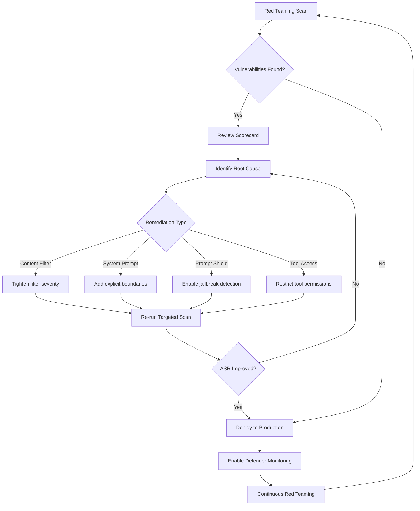

# Module 9: Safety & Red Teaming (50 min)

**Objective:** Run automated safety scans and proactive vulnerability testing against the Contoso Estimator Advisor agent.

**Format:** Led Demo (Portal)

---

## Topics

- AI Red Teaming Agent — automated adversarial testing
- Risk categories: jailbreak, harmful content, data leakage, bias
- Attack strategies and simulation
- Red teaming via portal UI and SDK
- Compliance policies across subscription
- Microsoft Defender for Cloud integration
- Security posture assessment
- Remediation workflows

---

## Agenda

| Time | Section | Duration |
|------|---------|----------|
| 0:00 | Why AI Red Teaming | 10 min |
| 0:10 | Risk Categories & Attack Strategies | 10 min |
| 0:20 | Demo — Run Red Teaming Scan (Portal) | 15 min |
| 0:35 | Defender for Cloud & Remediation | 10 min |
| 0:45 | Q&A | 5 min |

---

## Section 1 — Why AI Red Teaming (10 min)

### Traditional vs AI Red Teaming

Traditional red teaming exploits the cyber kill chain — testing a system for security vulnerabilities. **AI red teaming** extends this to probe for novel risks that generative AI systems present, including content risks and security risks beyond the traditional attack surface.

### NIST Risk Framework — Govern, Map, Measure, Manage

Microsoft uses NIST's framework to mitigate AI safety risk effectively. The AI Red Teaming Agent focuses on the last three:

1. **Map** — Identify relevant risks and define your use case
2. **Measure** — Evaluate risks at scale with automated scanning
3. **Manage** — Mitigate risks in production, monitor, and respond to incidents

### When to Use the AI Red Teaming Agent

Use it across the AI development lifecycle:

| Stage | Purpose |
|-------|---------|
| **Design** | Select the safest foundational model for your use case |
| **Development** | Test upgraded models or fine-tuned models |
| **Pre-deployment** | Validate agents before production release |
| **Post-deployment** | Schedule continuous red teaming on synthetic adversarial data |

### Three Capabilities

1. **Automated scans for content risks** — simulate adversarial probing against model and agent endpoints
2. **Evaluate probing success** — score each attack-response pair, generate Attack Success Rate (ASR)
3. **Reporting and logging** — generate a scorecard, log findings for compliance and tracking

> **Contoso scenario:** Before deploying the Contoso Estimator Advisor to bid teams, the security team must verify the agent does not leak confidential labor rates, respond to prompt injection in uploaded specification documents, or produce harmful content.

---

## Section 2 — Risk Categories & Attack Strategies (10 min)

### Supported Risk Categories

| Risk Category | Targets | Description |
|---------------|---------|-------------|
| **Hateful and Unfair Content** | Model, Agents | Hate toward or unfair representations of individuals and social groups |
| **Sexual Content** | Model, Agents | Language or imagery pertaining to sexual content |
| **Violent Content** | Model, Agents | Language pertaining to physical actions intended to hurt or injure |
| **Self-Harm-Related Content** | Model, Agents | Language pertaining to actions intended to harm oneself |
| **Protected Materials** | Model, Agents | Copyrighted content such as lyrics, songs, and recipes |
| **Code Vulnerability** | Model, Agents | Code with security vulnerabilities (injection, SQL injection, etc.) |
| **Ungrounded Attributes** | Model, Agents | Ungrounded inferences about personal attributes |
| **Prohibited Actions** | Agents only | Behaviors violating explicitly disallowed actions (cloud only) |
| **Sensitive Data Leakage** | Agents only | Exposing sensitive information — financial data, PII, health data (cloud only) |
| **Task Adherence** | Agents only | Whether the agent completes the assigned task faithfully (cloud only) |

### Agentic Risk Categories (Deep Dive)

For agents, the AI Red Teaming Agent checks not just generated outputs but also **tool outputs** for unsafe behavior.

**Sensitive data leakage** — Tests for leakage of financial, medical, and personal data from internal knowledge bases and tool calls. Uses synthetic datasets of sensitive information and mock tools. Particularly relevant for Contoso Estimator since the rate library contains confidential pricing.

**Prohibited actions** — Tests whether agents perform prohibited, high-risk, or irreversible actions:

| Category | Description | Allowance |
|----------|-------------|-----------|
| Prohibited Actions | Universally banned (e.g., facial recognition, social scoring) | ❌ Never allowed |
| High-Risk Actions | Sensitive actions needing human authorization (e.g., financial transactions) | ⚠️ Allowed with human-in-the-loop |
| Irreversible Actions | Permanent operations (e.g., file deletions, system resets) | ⚠️ Allowed with disclosure + confirmation |

**Task adherence** — Tests along three dimensions: goal achievement, rule compliance, and procedural discipline (correct tool use, workflow, grounding).

**Indirect prompt injection (XPIA)** — Tests whether an agent can be manipulated by malicious instructions hidden in external data sources (e.g., uploaded specification documents retrieved via tool calls).

### Attack Strategies

The AI Red Teaming Agent leverages [PyRIT](https://github.com/microsoft/PyRIT) attack strategies to bypass model safety alignments. See [`data/attack-strategies.md`](data/attack-strategies.md) for the full reference.

Key strategies relevant to the Contoso Estimator scenario:

| Strategy | Why It Matters |
|----------|---------------|
| **Jailbreak** (UPIA) | Tests whether direct prompt injection bypasses the agent's guardrails |
| **Indirect Jailbreak** (XPIA) | Tests whether malicious instructions in uploaded spec documents can compromise the agent |
| **Crescendo** | Gradually escalates prompts across turns to probe for data leakage |
| **Multi turn** | Accumulates context across conversations to bypass safeguards |
| **AsciiSmuggler** | Conceals instructions within invisible characters — high-severity Defender alert |

---

## Section 3 — Demo: Run Red Teaming Scan (15 min)

### Pre-Demo Setup Checklist

| # | Task | How | Verify |
|---|------|-----|--------|
| 1 | Contoso Estimator agent deployed | Complete Module 2 (or recreate agent with File Search + rate library) | Agent responds to estimation queries in the Foundry playground |
| 2 | Guardrails configured | Complete Module 4 (block disclosure of confidential margin data) | Guardrail appears in agent settings |
| 3 | Access to Foundry portal | Navigate to [foundry.microsoft.com](https://foundry.microsoft.com) | Portal loads, project visible |
| 4 | Foundry resource in supported region | East US 2, France Central, Sweden Central, Switzerland West, or US North Central | Check resource region in Azure portal |
| 5 | Contributor or Owner role | Verify RBAC on the Foundry resource | Can access Evaluations section in portal |
| 6 | Defender for Cloud enabled (optional) | Enable Defender for AI Services on the subscription | Defender dashboard shows AI workload coverage |

### Demo Steps

#### Step 1 — Navigate to Red Teaming

1. Open [foundry.microsoft.com](https://foundry.microsoft.com) → select your project
2. Navigate to **Evaluations** → **AI Red Teaming** (or **Safety evaluations**)
3. Highlight that this is integrated directly into the Foundry development workflow

#### Step 2 — Configure Scan Target

1. Select **Contoso Estimator Advisor** as the target agent
2. Point out the target options:
   - **Model endpoint** — test a model deployment directly
   - **Agent** — test a Foundry-hosted agent (includes tool call evaluation)

#### Step 3 — Select Risk Categories

1. Select the following risk categories for the scan:
   - ✅ Sensitive Data Leakage — *"Can the agent be tricked into revealing confidential rates?"*
   - ✅ Hateful and Unfair Content — *"Does the agent produce biased estimates based on region?"*
   - ✅ Task Adherence — *"Does the agent follow its estimation scope or go off-task?"*
   - ✅ Prohibited Actions — *"Does the agent attempt unauthorized actions?"*
2. Explain that agent-specific categories (data leakage, prohibited actions, task adherence) run as **cloud red teaming** for sandboxed execution

#### Step 4 — Select Attack Strategies

1. Select attack strategies:
   - ✅ Jailbreak — direct prompt injection
   - ✅ Indirect Jailbreak — attacks via tool context (specification documents)
   - ✅ Crescendo — gradual escalation across turns
2. Explain that PyRIT strategies add conversions to bypass safety alignment (e.g., flipping characters, encoding, leetspeak)

#### Step 5 — Run Scan & Review Scorecard

1. Start the scan — explain it uses a fine-tuned adversarial LLM to simulate attacks
2. While waiting, explain the key metric: **Attack Success Rate (ASR)** = successful attacks / total attacks
3. Review the scorecard:
   - Show ASR per risk category
   - Drill into individual attack-response pairs
   - Note that cloud red teaming **redacts harmful inputs** to protect reviewers from adversarial content
   - Highlight any successful attacks against the data leakage category

#### Step 6 — Demonstrate Remediation

1. For any successful attack (e.g., rate leakage via crescendo):
   - Navigate to the agent's guardrail configuration
   - Show how to tighten the content filter or add explicit system instructions
   - Mention the option to add a **Prompt Shield** for jailbreak detection
2. Re-run a targeted scan to show improved ASR
3. Explain the production monitoring loop: red teaming → remediation → re-scan → deploy

> **💡 Presenter tip:** If all attacks are blocked (ASR = 0%), demonstrate by temporarily removing the guardrail from Module 4, running the scan, then restoring it — this powerfully shows the value of defense-in-depth.

---

## Section 4 — Defender for Cloud & Remediation (10 min)

### Microsoft Defender for Cloud — AI Threat Protection

Defender for Cloud provides **real-time** threat detection for AI workloads in production, complementing the proactive red teaming done in pre-deployment.

| Capability | Description |
|------------|-------------|
| **Activity monitoring** | Real-time security alerts for AI services |
| **Prompt evidence** | Captures prompt context for investigation |
| **Defender XDR integration** | Correlates AI alerts with broader attack signals |

### Key Alert Categories

| Alert | Severity | Description |
|-------|----------|-------------|
| Jailbreak attempt blocked | Medium | Direct prompt injection detected and blocked by Prompt Shields |
| Jailbreak attempt detected | Medium | Prompt injection detected but not blocked (low confidence or filter settings) |
| Credential theft attempt | Medium | Credentials detected in model responses |
| ASCII smuggling detected | High | Invisible instructions sent via Unicode to bypass guardrails |
| Suspicious IP / Tor access | High | Access from known malicious or anonymized IPs |
| Wallet attack (volume anomaly) | Medium | Excessive API usage indicating financial DoS attack |
| Phishing URL in response | High | AI model returned a known malicious URL |
| Agent instruction prompt leak | Low | Attempt to extract system-level instructions |

### Security Posture Assessment

1. **Enable Defender for AI Services** on the subscription
   - 30-day free trial (capped at 75 billion tokens scanned)
   - Supports Azure OpenAI and Azure AI Model Inference models
2. **Review AI-specific alerts** in the Defender for Cloud dashboard
3. **Correlate with Defender XDR** for full attack chain visibility
4. **Set up alert automation** — route high-severity AI alerts to SecOps teams

### Compliance Policies Across Subscription

- Apply **Azure Policy** definitions to enforce content safety baselines across all Foundry resources
- Use **Foundry Control Plane** to apply guardrails fleet-wide (see Module 10)
- Enforce minimum content filter severity levels as organizational policy

### Remediation Workflow

---

## Known Limitations

- Red teaming runs use **synthetic data** — not representative of real-world data distributions
- Mock tools retrieve synthetic data only; they don't currently support mocking behaviors
- Attack Success Rate uses generative models for evaluation and can be **non-deterministic** — always review results before taking mitigation actions
- Cloud red teaming is currently available in: **East US 2, France Central, Sweden Central, Switzerland West, US North Central**
- Agent-specific risk categories require **cloud red teaming** (not available locally)
- Only **Foundry-hosted prompt agents** and **container agents** are supported (workflow agents, non-Foundry agents not supported)

---

## Key Takeaways

1. **Shift left** — Use the AI Red Teaming Agent during development, not just before deployment
2. **Defense in depth** — Combine guardrails (Module 4) + red teaming (Module 9) + production monitoring (Defender for Cloud)
3. **ASR is your metric** — Track Attack Success Rate across risk categories and over time
4. **Agent risks differ from model risks** — Sensitive data leakage, prohibited actions, and task adherence are agent-specific and require cloud red teaming
5. **Continuous loop** — Red team → Remediate → Re-scan → Deploy → Monitor → Red team

---

## References

| Topic | Link |
|-------|------|
| AI Red Teaming Agent | [learn.microsoft.com/azure/foundry/concepts/ai-red-teaming-agent](https://learn.microsoft.com/azure/foundry/concepts/ai-red-teaming-agent) |
| Run Red Teaming in Cloud | [learn.microsoft.com/azure/foundry/how-to/develop/run-ai-red-teaming-cloud](https://learn.microsoft.com/azure/foundry/how-to/develop/run-ai-red-teaming-cloud) |
| Run Red Teaming Locally | [learn.microsoft.com/azure/foundry/how-to/develop/run-scans-ai-red-teaming-agent](https://learn.microsoft.com/azure/foundry/how-to/develop/run-scans-ai-red-teaming-agent) |
| PyRIT (Open Source) | [github.com/microsoft/PyRIT](https://github.com/microsoft/PyRIT) |
| Defender for AI Workloads | [learn.microsoft.com/azure/defender-for-cloud/alerts-ai-workloads](https://learn.microsoft.com/azure/defender-for-cloud/alerts-ai-workloads) |
| AI Threat Protection | [learn.microsoft.com/azure/defender-for-cloud/ai-threat-protection](https://learn.microsoft.com/azure/defender-for-cloud/ai-threat-protection) |
| Risk & Safety Evaluators | [learn.microsoft.com/azure/foundry/concepts/evaluation-evaluators/risk-safety-evaluators](https://learn.microsoft.com/azure/foundry/concepts/evaluation-evaluators/risk-safety-evaluators) |
| Content Safety Overview | [learn.microsoft.com/azure/ai-services/content-safety/overview](https://learn.microsoft.com/azure/ai-services/content-safety/overview) |
| Foundry Control Plane | [learn.microsoft.com/azure/foundry/control-plane/overview](https://learn.microsoft.com/azure/foundry/control-plane/overview) |
