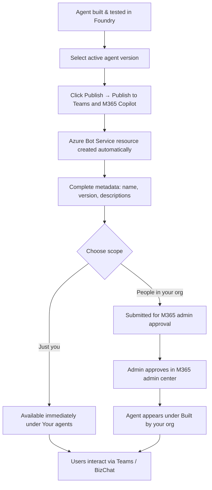

# Module 10: Fleet Management & Agent 365 (50 min)

**Objective:** Manage agents at enterprise scale and publish to Microsoft 365.

**Topics:**

- Foundry Control Plane — single pane of glass for all AI assets
- Fleet-wide KPIs: active agents, run completion, cost trends, prevented behaviors
- Agent inventory and lifecycle management
- Registering external/non-Foundry agents
- Health scoring and alerting
- Publishing to Microsoft 365 (Teams, BizChat, Azure Bot Service)
- Agent 365 enterprise governance
- Multi-tenant considerations

**Demo (Portal-Led):** Explore fleet dashboard, register external agent, publish Contoso Estimator agent to Teams

**Reference:** [Foundry Control Plane](https://learn.microsoft.com/azure/foundry/control-plane/overview) | [Publish to Copilot](https://learn.microsoft.com/azure/foundry/agents/how-to/publish-copilot)

---

## Pre-Demo Setup Checklist

Complete these steps **before** presenting this module.

| # | Task | How | Verify |
|---|------|-----|--------|
| 1 | Foundry resource + project provisioned | Use existing resource from Module 1 | Project visible in [Foundry portal](https://ai.azure.com) |
| 2 | Contoso Estimator Advisor agent deployed and tested | Built in Modules 2–9 with active version selected | Agent responds correctly in Foundry playground |
| 3 | Application Insights connected to project | **Project Settings** → **Tracing** → select or create App Insights resource | Traces appear under **Operate** → **Assets** → agent **Traces** tab |
| 4 | AI Gateway configured | **Project Settings** → **AI Gateway** → enable API Management gateway | Gateway status shows **Enabled** |
| 5 | RBAC roles assigned | Ensure presenter has **Foundry User** + **Foundry Account Owner** on subscription | `az role assignment list --assignee <upn>` shows both roles |
| 6 | Cost Management Reader role | Assign **Cost Management Reader** on subscription for cost KPI tiles | Cost tiles populate on Overview pane |
| 7 | Log Analytics Reader role | Assign on the Application Insights resource | Health metrics visible in fleet dashboard |
| 8 | `Microsoft.BotService` provider registered | `az provider register --namespace Microsoft.BotService` | `az provider show -n Microsoft.BotService --query registrationState` returns `Registered` |
| 9 | Microsoft 365 tenant access (optional) | Ensure presenter has M365 admin or can coordinate with an admin for approval | Can access [M365 admin center](https://admin.cloud.microsoft) |
| 10 | External agent endpoint (optional) | Prepare a mock or sample agent endpoint with an A2A agent card at `/.well-known/agent-card.json` | Agent card URL returns valid JSON |

---

## Concept: Foundry Control Plane (15 min)

### What Is Foundry Control Plane?

Foundry Control Plane is a **unified management interface** that provides visibility, governance, and control for AI agents, models, and tools across your Foundry enterprise. It centralizes management for your AI agent fleet from build to production.

> **When to use:** Your organization manages multiple agents across projects, requires centralized compliance visibility, integrates Microsoft Defender and Purview for governance, or operates agents from multiple platforms (Foundry, Microsoft, and non-Microsoft).

### Core Capabilities

| Capability | Description |
|------------|-------------|
| **Fleet management** | Track KPIs — active agents, run completion, compliance posture, cost efficiency, and prohibited behaviors across [supported platforms](https://learn.microsoft.com/azure/foundry/control-plane/how-to-manage-agents#supported-agent-platforms) |
| **Observability** | Correlate alerts, evaluation results, and trace data; drill down from fleet metrics to individual agent traces |
| **Compliance enforcement** | Define enterprise-wide guardrail policies; apply bulk remediation across the fleet |
| **Security** | Schedule automated red-teaming scans, view Defender and Purview alerts on the dashboard, track rate limits and cost anomalies |

### How Monitoring Works

Foundry Control Plane discovers all agents you can access and aggregates logs and metrics from Application Insights resources connected to each agent. Agents must log diagnostic information following **OpenTelemetry semantic conventions for Generative AI**.

```
┌──────────────────────┐     ┌──────────────────────┐     ┌──────────────────────┐
│  Foundry Agents      │     │  Azure SRE Agent     │     │  Custom Agents       │
│  (Prompt / Hosted /  │     │                      │     │  (Registered)        │
│   Workflow)          │     │                      │     │                      │
└────────┬─────────────┘     └────────┬─────────────┘     └────────┬─────────────┘
         │                            │                            │
         │    OpenTelemetry spans     │    OpenTelemetry spans     │
         ▼                            ▼                            ▼
┌─────────────────────────────────────────────────────────────────────────────────┐
│                        Application Insights                                     │
│                   (Logs, Metrics, Traces per project)                           │
└────────────────────────────────────┬────────────────────────────────────────────┘
                                     │
                                     ▼
┌─────────────────────────────────────────────────────────────────────────────────┐
│                     Foundry Control Plane Dashboard                             │
│          Fleet health │ Cost tracking │ Anomaly detection │ Drill-down          │
└─────────────────────────────────────────────────────────────────────────────────┘
```

> **Important:** Agents running on resources without Application Insights won't have health metrics, cost tracking, or drill-down traces.

### Supported Agent Platforms

Foundry Control Plane discovers agents from:

- **Foundry agents** — Prompt agents, Hosted agents, Workflow agents
- **Azure SRE Agent**
- **Azure Logic Apps agent loops**
- **Custom agents** — registered manually via the portal

---

## Demo Part 1: Explore Fleet Dashboard (10 min)

### Portal Walkthrough

> **Presenter narrates while navigating the portal.**

**Step 1 — Open Control Plane**

1. Sign in to [Microsoft Foundry portal](https://ai.azure.com). Ensure the **New Foundry** toggle is on.
2. On the toolbar, select **Operate**.

**Step 2 — Review Overview Pane**

1. The **Overview** pane shows fleet-level metrics across all agents in the subscription:
   - **Active agents** — total agents discovered
   - **Run completion rate** — percentage of successful agent runs
   - **Error trends** — aggregated error rates over time
   - **Cost trends** — token usage and budget consumption
   - **Prevented behaviors** — blocked actions from guardrail policies
2. Use the **project dropdown** to scope metrics to a specific project.
3. Adjust the **date range** selectors in the upper-right corner.

**Step 3 — Agent Inventory**

1. Select **Assets** → **Agents** tab.
2. The inventory shows a searchable table of all agents with:
   - Agent name, type, and platform
   - Health status (based on error rates and completion)
   - Last activity timestamp
   - Associated project and Application Insights resource
3. Select the **Contoso Estimator Advisor** agent to view its detail pane.

**Step 4 — View Agent Traces**

1. On the agent detail pane, select the **Traces** tab.
2. Each row represents a call made to the agent with **Trace ID** and **Conversation ID**.
3. Select a Trace ID to drill into the full trace with LLM calls, tool invocations, and latencies.

> 💡 **Talking point:** "Control Plane aggregates information across Application Insights resources within the subscription. Different users see different agents depending on their RBAC access — this is role-aware visibility, not a single admin-only view."

---

## Demo Part 2: Register External Agent (5 min)

### Registering a Non-Foundry Agent

Organizations often have agents built on other platforms (Amazon Bedrock, Google Vertex AI, custom frameworks). Foundry Control Plane supports two registration approaches:

| Approach | Description | Use Case |
|----------|-------------|----------|
| **Control Plane custom agent** | Routes traffic through AI Gateway; full proxy and monitoring | Agents you want Foundry to manage and route |
| **External agent (preview)** | Agent keeps its endpoint; shares only OpenTelemetry telemetry | Agents that need observability without traffic routing |

### Portal Walkthrough — Register Custom Agent

> **Presenter demonstrates registering a sample external agent.**

1. Navigate to **Operate** → **Assets** → **Agents**.
2. Select **+ Register agent**.
3. Provide:
   - **Name**: e.g., `contoso-scheduling-bot`
   - **Protocol**: Select **A2A** (Agent-to-Agent) or **Custom**
   - **Endpoint URL**: The agent's reachable URL
4. Foundry generates a **proxy URL** and discovers the agent card at `/.well-known/agent-card.json`.
5. The registered agent now appears in the fleet inventory with health metrics (once Application Insights data flows).

> 💡 **Talking point:** "This means your fleet dashboard becomes the single pane of glass for *all* agents in the enterprise — not just the ones built in Foundry. External agents from any platform can be registered for centralized governance."

**Reference:** [Register Custom Agents](https://learn.microsoft.com/azure/foundry/control-plane/register-custom-agent)

---

## Concept: Publishing to Microsoft 365 (10 min)

### Why Publish to M365?

After building and testing an agent in Foundry, the next step is sharing it where users already work — Microsoft Teams and Microsoft 365 Copilot. Publishing creates a stable endpoint so end users interact with a consistent agent entity while you roll out new versions seamlessly.

> ⚠️ **Preview:** Publishing agents to Microsoft 365 Copilot and Teams is an "Early Access Preview" subject to [Azure Preview Supplemental Terms](https://azure.microsoft.com/support/legal/preview-supplemental-terms/).

### Publishing Flow



### Publish Scope Options

| Option | Behavior | Admin Approval | Best For |
|--------|----------|----------------|----------|
| **Just you** | Available immediately; share via agent link | Not required | Personal testing, small teams, pilots |
| **People in your organization** | Submitted for M365 admin review; org-wide once approved | Required | Production deployments, organization-wide distribution |

### Required Metadata

| Field | Description |
|-------|-------------|
| **Name** | Display name in the agent store |
| **Publish version** | Semantic version (major.minor.patch) |
| **Short description** | One-sentence summary |
| **Description** | Longer description of capabilities and actions |
| **Developer** | Author name or organization |

### Prerequisites for Publishing

- **Foundry User** role on the Foundry project
- Azure subscription with `Microsoft.BotService` provider registered
- Agent thoroughly tested with active version selected
- For org-wide publishing: coordination with M365 admin

---

## Demo Part 3: Publish Contoso Estimator to Teams (10 min)

### Portal Walkthrough

> **Presenter publishes the Contoso Estimator agent to Teams.**

**Step 1 — Select Active Version**

1. Open the **Contoso Estimator Advisor** agent in Foundry portal.
2. Select **Publish** from the toolbar.
3. In the publish dropdown, select the arrow next to **Active version**.
4. Choose **Always use latest** or select a specific version.

**Step 2 — Publish to Teams and M365 Copilot**

1. Select **Publish to Teams and Microsoft 365 Copilot**.
2. An Azure Bot Service resource is automatically created (or shown read-only if one exists).
3. Complete the metadata:
   - **Name**: `Contoso Estimator Advisor`
   - **Publish version**: `1.0.0`
   - **Short description**: `Helps estimators prepare project bids with rate lookups and cost calculations`
   - **Description**: `The Contoso Estimator Advisor assists bid teams by searching historical project data, looking up rate libraries, referencing company policies, and performing preliminary cost calculations.`
   - **Developer**: `Contoso Infrastructure`

**Step 3 — Choose Scope and Publish**

1. Select **Next: Publish options**.
2. On the **Direct publish** tab, choose **Just you** (for demo purposes).
3. Select **Publish**.
4. Confirm the **Publish successful** dialog.

**Step 4 — Verify in Teams** (if M365 access available)

1. Open Microsoft Teams.
2. Go to **Apps** → **Your agents**.
3. Find **Contoso Estimator Advisor** and start a conversation.
4. Ask: *"What is the labor rate for a senior estimator in Auckland?"*

> 💡 **Talking point:** "The key concept here is that the stable endpoint URL stays the same after publishing. When you deploy a new version of the agent, you simply update the active version selector — no need to republish to M365/Teams."

### Alternative: Download & Customize

For advanced scenarios, select **Download & customize** instead of direct publish:

1. Download the ZIP containing the agent manifest.
2. Customize the manifest as needed.
3. In Teams: **Apps** → **Manage your apps** → **Upload an app** → select the ZIP.

---

## Concept: Agent 365 Enterprise Governance (10 min)

### What Is Microsoft Agent 365?

[Microsoft Agent 365 (A365)](https://learn.microsoft.com/microsoft-agent-365/overview) is Microsoft's IT admin control plane for AI agents. It provides identity, security, governance, and lifecycle management controls for agents at scale — regardless of where they are built or acquired.

### Agent 365 Core Capabilities

| Capability | Description |
|------------|-------------|
| **Registry** | Complete inventory of all agents in the organization — Foundry, Copilot Studio, registered external agents, and shadow agents discovered in the tenant |
| **Access control** | Microsoft Entra–based controls and risk-based Conditional Access policies; network controls for endpoint-hosted agents |
| **Visualization** | Explore connections between agents, people, and data; monitor behavior and performance in real time |
| **Interoperability** | Equips agents with access to Microsoft 365 apps and organizational data; connects to Work IQ for organizational context |
| **Security** | Integrates with Microsoft Defender and Microsoft Purview; protects against oversharing, leaks, and risky behavior |

### How Foundry Integrates with Agent 365

1. **Automatic registry sync** — All Foundry agents automatically appear in the Agent 365 registry on creation. No extra configuration required.
2. **Autopilot publishing** — Foundry Hosted agents can be published as *autopilots* (agents that act autonomously and receive their own Microsoft Entra Agent ID).

| Agent Type | Registry Sync | Autopilot Publishing | Activity Data Collection |
|------------|:------------:|:--------------------:|:------------------------:|
| **Prompt agent** | ✅ | ✅ | ✅ |
| **Hosted agent** | ✅ | ✅ | Supported using A365 SDK |
| **Workflow agent** | ✅ | ❌ | ❌ |

> **Note:** Workflow agents appear in the Agent 365 registry but do not currently support autopilot publishing or activity data collection. For observability of workflow agents, use Foundry Control Plane traces and Application Insights directly.

### Connecting External Agents to Agent 365

For agents built outside the Microsoft ecosystem:

1. **Registry sync** — Synchronize external agents (Amazon Bedrock, Google Vertex AI, etc.) into the Agent 365 registry for centralized visibility
2. **Agent 365 SDK integration** — Extend existing agents with enterprise-grade identity, observability, notifications, and governed access to M365 data
3. **Apply policies and access controls** — Configure role-based access and data access policies through [Agent tenant settings](https://learn.microsoft.com/microsoft-365/admin/manage/agent-settings)

### Multi-Tenant Considerations

When deploying agents across multiple tenants:

- **Authorization schemes**: Choose between `BotServiceRbac` (only identities with Azure permissions) and `BotServiceTenant` (everyone in the tenant)
- **Visibility vs. access**: Publishing scope (who *sees* the agent) is separate from authorization (who *can call* the agent) — these can be combined independently
- **Private networking**: For projects with private endpoints, the one-click publish button is unavailable — use the [manual publish flow](https://learn.microsoft.com/azure/foundry/agents/how-to/publish-copilot-virtual-network) with Azure CLI
- **Data residency**: Manage whether data flows outside your organization's Azure compliance and geographic boundaries

**Reference:** [Agent 365 Integration](https://learn.microsoft.com/azure/foundry/agents/concepts/agent-365-integration) | [Foundry Agents in Agent 365](https://learn.microsoft.com/azure/foundry/agents/how-to/agent-365) | [Connect Existing Agents](https://learn.microsoft.com/microsoft-agent-365/connect-existing-agents)

---

## Key Takeaways

| Takeaway | Detail |
|----------|--------|
| **Single pane of glass** | Foundry Control Plane unifies fleet management for Foundry agents, Azure SRE agents, Logic Apps agents, and custom-registered agents |
| **Role-aware visibility** | Different users see different agents based on RBAC — this is not a single admin-only view |
| **Publish once, update versions** | Stable endpoint URL stays the same; update the active version selector to roll out new agent code |
| **Two governance layers** | Foundry Control Plane (Azure-side fleet ops) + Agent 365 (M365-side enterprise governance) work together |
| **Bring any agent** | External and non-Microsoft agents can be registered in Control Plane and synced to Agent 365 |

---

## Reference Links

| Topic | URL |
|-------|-----|
| Foundry Control Plane Overview | https://learn.microsoft.com/azure/foundry/control-plane/overview |
| Monitor Agent Fleet | https://learn.microsoft.com/azure/foundry/control-plane/monitoring-across-fleet |
| Manage Agents at Scale | https://learn.microsoft.com/azure/foundry/control-plane/how-to-manage-agents |
| Register Custom Agents | https://learn.microsoft.com/azure/foundry/control-plane/register-custom-agent |
| Publish to Teams and M365 | https://learn.microsoft.com/azure/foundry/agents/how-to/publish-copilot |
| Publish in Virtual Network | https://learn.microsoft.com/azure/foundry/agents/how-to/publish-copilot-virtual-network |
| Agent 365 Integration | https://learn.microsoft.com/azure/foundry/agents/concepts/agent-365-integration |
| Foundry Agents in Agent 365 | https://learn.microsoft.com/azure/foundry/agents/how-to/agent-365 |
| Connect External Agents to A365 | https://learn.microsoft.com/microsoft-agent-365/connect-existing-agents |
