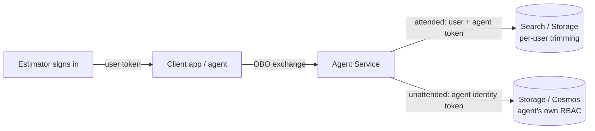

# Module 12: Secure Agent Identity & Access (45 min)

**Version:** 1.0
**Last Updated:** July 2026
**Format:** Led Demo
**Prerequisite:** Module 2 complete (Contoso Estimator agent exists); Module 1 RBAC concepts

---

## Objective

Give the Contoso Estimator agent its **own least-privilege identity** — so it accesses downstream data (Storage, Search, Key Vault) without shared secrets — and pass the **signed-in user's identity** through to enforce per-user access.

---

## Topics

### 12.1 Why agent identity matters

The Contoso Estimator calls tools that reach real data — rate libraries in Storage, the knowledge base in Azure AI Search, secrets in Key Vault. Two questions decide the security posture:

1. **What is the agent allowed to do?** → the *agent's own identity* and its RBAC.
2. **On whose behalf is it acting?** → the *user's identity*, passed through for per-user trimming.

Without dedicated identities, teams fall back to API keys or a single shared managed identity — over-privileged, hard to audit, and impossible to scope per user.

### 12.2 The three identities in play

| Identity | What it represents | Used for |
|----------|-------------------|----------|
| **User identity** | The signed-in estimator (Entra user) | Per-user access (row-level security, delegated calls) |
| **Agent identity** | An Entra **service principal** that represents the agent at runtime | The agent's own least-privilege access to tools/resources |
| **Project managed identity** | The Foundry project's identity | Shared identity for *unpublished* agents and platform operations |

> **Key rule:** Unpublished agents share the **project** identity. When you **publish** an agent, it gets a **distinct** agent identity — you must **re-assign** downstream RBAC to that new identity.

### 12.3 Foundry RBAC — least-privilege personas

| Persona | Role (current term) | Scope | Purpose |
|---------|--------------------|-------|---------|
| IT Admin | Owner | Subscription | Provision resource, assign account owners |
| Platform lead | Foundry Account Owner | Foundry resource | Deploy models, manage connections/networking |
| Team lead | Foundry Project Manager | Foundry resource | Create projects, **publish agents**, assign Foundry User |
| Developer | Foundry User | Project (+ Reader on resource) | Build agents, run evaluations |
| Agent (runtime) | *Data-plane role on target* (e.g. Storage Blob Data Reader) | Downstream resource | Least-privilege tool access |

> ⚠️ Some Azure portal surfaces still show the classic names (**Azure AI User**, **Azure AI Account Owner**, etc.). Role IDs and permissions are unchanged — see the terminology table in the workshop guidelines.

📖 [Role-based access control in Foundry](https://learn.microsoft.com/azure/foundry/concepts/rbac-foundry)

### 12.4 Two authentication patterns

Agent identities authenticate downstream in two ways:

| Pattern | OAuth flow | When | Who the resource sees |
|---------|-----------|------|-----------------------|
| **Attended (OBO / delegated)** | On-Behalf-Of | Agent acts *for a user* | The **user** (scoped to their consent) |
| **Unattended (app-only)** | Client credentials | Backend / autonomous run | The **agent identity** |



> **Where does the user token actually flow?** There are **two** ways to realize
> the attended/OBO pattern, and they behave differently:
>
> | Model | Who exchanges/forwards the user token | Per-user? |
> |---|---|---|
> | **A · App-mediated** — the app does the OBO exchange (`Microsoft.Identity.Web` + `Microsoft.Identity.Web.AgentIdentities`) or forwards the user's delegated token and calls the resource itself | Your app | ✅ Yes |
> | **B · Agent-mediated** — Agent Service forwards the user's identity to the tool | Agent Service | ✅ for **Fabric, Work IQ, OAuth MCP/A2A** tools; ⚠️ **static-only** for Foundry IQ Search RLS |
>
> **Which tools support agent-mediated (Model B) per-user identity?** Fabric data
> agent and Work IQ use OBO passthrough; OAuth-compliant MCP servers and A2A
> endpoints use OAuth identity passthrough (consent link + stored token). For the
> **Foundry IQ `knowledge_base_retrieve`** tool, you *can* attach a
> `x-ms-query-source-authorization` header, but Agent Service
> [can't vary it per request](https://learn.microsoft.com/azure/foundry/agents/how-to/foundry-iq-connect)
> — it's one fixed identity for all callers, **not** per-user. For per-user Search
> RLS, use the **Azure OpenAI Responses API** or the **app-mediated retrieve**
> (Module 3 Track 2).

### 12.5 Runtime token exchange (no secrets in code)

When an agent invokes a tool, Agent Service performs a multi-stage OAuth 2.0 exchange automatically — **developers never handle tokens**:

1. **Blueprint authentication** — Agent Service proves it may act for the agent's blueprint.
2. **Agent identity token** — Entra issues a token for the specific agent identity (distinct from user/managed-identity tokens).
3. **Scoped token request** — exchanged for a token scoped to the downstream **audience**.
4. **Tool call** — the scoped token authenticates the call.

**Audience must match the target service**, not the tool/MCP URL:

| Downstream service | Audience |
|--------------------|----------|
| Azure Storage | `https://storage.azure.com` |
| Azure Cosmos DB | `https://cosmos.azure.com` |
| Azure Key Vault | `https://vault.azure.net` |
| Microsoft Graph | `https://graph.microsoft.com` |
| Azure AI Search (delegated) | `https://search.azure.com` |

> An incorrect audience causes auth failures **even when RBAC is correct**.

📖 [Agent identity concepts](https://learn.microsoft.com/azure/foundry/agents/concepts/agent-identity) · deep dive: [docs/agent-identity-deep-dive.md](docs/agent-identity-deep-dive.md)

---

## Demo

### Part A — Grant the agent its own least-privilege access (unattended)

**Step 1: Find the agent identity**

For an unpublished agent, tool calls use the **project** managed identity. For a published agent, retrieve its distinct identity's principal ID:

```powershell
# Published Agent Application / hosted agent identity
az rest --method GET `
  --url "$($env:FOUNDRY_ENDPOINT)/agents/$($env:AGENT_NAME)?api-version=2025-05-01" `
  --resource "https://ai.azure.com" `
  --query "instance_identity.principal_id" -o tsv
```

**Step 2: Assign least-privilege RBAC on the target resource**

Use the helper script (assigns *Storage Blob Data Reader* by default — read-only rate library):

```powershell
./infra/assign-agent-identity-rbac.ps1 `
  -AgentIdentityId "<principal-id>" `
  -Role "Storage Blob Data Reader" `
  -Scope "/subscriptions/<sub>/resourceGroups/<rg>/providers/Microsoft.Storage/storageAccounts/<sa>"
```

> Uses `--assignee-object-id` + `--assignee-principal-type ServicePrincipal` to avoid Graph lookup issues with agent-identity service principals.

**Step 3: Show it works — then break it**

1. Ask the agent to read a rate file → succeeds.
2. Remove the role assignment (`teardown.ps1`) → the same call now fails with 403. This proves the agent has **no** ambient access; every capability is an explicit, auditable grant.

### Part B — Pass the user through (app-mediated delegated access)

Reuse the already-built delegated-RLS web app from Module 3:

1. Open [../03-agentic-rag/src/track2-identity-rls](../03-agentic-rag/src/track2-identity-rls).
2. Sign in as the **NSW** estimator → only NSW rates. Sign in as **VIC** → only VIC rates.
3. Same code, same query — only the **identity** differs. The app sets **no** filter; Azure AI Search trims rows from the user's Entra claims passed via `x-ms-query-source-authorization`.

This is **Model A (app-mediated)**: the app forwards the signed-in user's delegated
token and calls Search **directly** — Agent Service is *not* in the path, which is
why per-user trimming works. Agent-mediated per-user identity (Model B) works for
Fabric / Work IQ / OAuth MCP+A2A tools, but for Foundry IQ Search RLS the agent
can only carry a **static** header — use the Responses API for per-user through an
agent.

### Part C — Inspect a token (optional, 5 min)

Run the token inspector to *see* the difference between a user token and a service token:

```powershell
cd src/IdentityInspector
dotnet run -- <paste-a-jwt>
```

It decodes the JWT and classifies it (user vs service/agent vs managed identity) from `idtyp`, `appid`, `oid`, and `scp`/`roles` claims — reinforcing why "who is calling" is a claims decision, not a guess.

---

## Pre-Demo Checklist

| # | Task | How | Verify |
|---|------|-----|--------|
| 1 | Contoso Estimator agent exists | Module 2 | Agent visible in project |
| 2 | Storage account with a sample rate file | Module 1 infra | Blob readable by you |
| 3 | You have **Owner / User Access Administrator** on the scope | `az role assignment list` | Can create role assignments |
| 4 | Track 2 OBO app configured | Module 3 setup | `dotnet build` succeeds; two test users sign in |
| 5 | .NET 10 SDK installed | `dotnet --version` | `10.x` |
| 6 | Logged into the demo tenant | `az login --tenant <tenant>` | `az account show` correct |

---

## Key Takeaways

- Give each **published** agent its **own** identity and re-assign RBAC on publish.
- Prefer **Entra ID** auth over API keys — keys grant full, unscoped, unauditable access.
- Use **delegated (OBO)** access for per-user permissions — either **app-mediated**
  (the app forwards the user token) or **agent-mediated** OAuth passthrough
  (Fabric, Work IQ, OAuth MCP/A2A). Foundry IQ Search RLS through an agent is
  **static-only** — per-user needs the Responses API or app-mediated retrieve.
- Match the **audience** to the target service, and grant the **narrowest** data-plane role.

---

## Reference

| Topic | Link |
|-------|------|
| Agent identity concepts | https://learn.microsoft.com/azure/foundry/agents/concepts/agent-identity |
| RBAC in Foundry | https://learn.microsoft.com/azure/foundry/concepts/rbac-foundry |
| Agent-to-agent authentication | https://learn.microsoft.com/azure/foundry/agents/concepts/agent-to-agent-authentication |
| Elevated-role tasks (publish/reassign) | https://learn.microsoft.com/azure/foundry/concepts/administrator-guide |
| Manage hosted agent identity | https://learn.microsoft.com/azure/foundry/agents/how-to/manage-hosted-agent |
