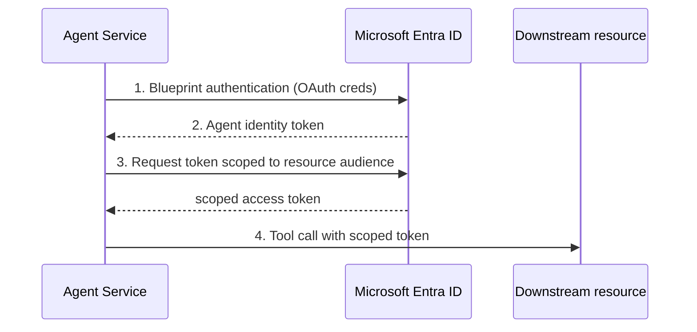

# Agent Identity — Deep Dive

> Companion to [Module 12](../README.md). Verified against Microsoft Learn, July 2026.

## What an agent identity is

An **agent identity** is a specialized Microsoft Entra ID service principal that represents an AI agent at runtime. Foundry provisions and manages it across the agent lifecycle. It exists to solve identity problems unique to agents:

- Distinguish **agent** actions from user, workforce, or workload actions in audit logs.
- Give agents **right-sized** (least-privilege) access instead of a shared, over-scoped identity.
- Prevent agents from acquiring critical security roles.
- Scale identity management to many short-lived agents.

## Blueprint vs identity

| Term | Meaning |
|------|---------|
| **Agent identity blueprint** | An Entra object that governs a *class* of agents and performs lifecycle operations (create/update/delete identities). |
| **Agent identity** | The service principal for a *specific* agent, created and impersonated via the blueprint. |
| `agentIdentityId` | The identifier used when assigning RBAC to the agent identity (from the project/agent JSON view). |

The blueprint holds OAuth credentials (client secret, certificate, or **federated credential / managed identity**). Federated credentials are preferred — no stored secrets, automatic rotation.

> The managed identity authenticates the **blueprint** to Entra. It does **not** access the downstream resource. The **agent identity** is the principal that needs RBAC on the target.

## Unpublished vs published

| State | Identity used for tool calls | RBAC action |
|-------|------------------------------|-------------|
| **Unpublished** | Shared **project** identity | Grant on project identity |
| **Published** (Agent Application) | **Distinct** agent identity | **Re-assign** roles to the new identity on every downstream resource |

Publishing requires **Foundry Project Manager**. Re-assigning RBAC to the published identity requires **Owner** or **User Access Administrator** on the target resource.

## Runtime token exchange (4 stages)



Developers never handle these tokens — Agent Service performs the exchange.

## Assigning RBAC to an agent identity

```azurecli
# Grant read-only blob access to the agent identity
az role assignment create \
  --assignee-object-id "<agentIdentityId>" \
  --assignee-principal-type ServicePrincipal \
  --role "Storage Blob Data Reader" \
  --scope "/subscriptions/<sub>/resourceGroups/<rg>/providers/Microsoft.Storage/storageAccounts/<sa>"

# Verify
az role assignment list --assignee "<agentIdentityId>" \
  --scope "/subscriptions/<sub>/resourceGroups/<rg>/providers/Microsoft.Storage/storageAccounts/<sa>" -o table
```

`--assignee-object-id` + `--assignee-principal-type ServicePrincipal` avoids Microsoft Graph lookup errors for agent-identity service principals.

## Audience values

| Downstream service | Audience |
|--------------------|----------|
| Azure Storage | `https://storage.azure.com` |
| Azure Cosmos DB | `https://cosmos.azure.com` |
| Azure Key Vault | `https://vault.azure.net` |
| Azure Logic Apps | `https://logic.azure.com` |
| Microsoft Graph | `https://graph.microsoft.com` |
| Azure AI Search (delegated) | `https://search.azure.com` |

An incorrect audience fails authentication **even when RBAC is correct**.

## Limitations & common failures

- Only some tools support agent-identity auth today — check the tool's docs.
- **Per-user RLS through an agent is *static*, not per-request.** You can attach a
  `x-ms-query-source-authorization` header to a Foundry IQ knowledge-base MCP tool
  (works for permission-filtered search indexes, not just SharePoint), but
  [Agent Service can't vary headers per request](https://learn.microsoft.com/azure/foundry/agents/how-to/foundry-iq-connect)
  — the token is fixed at agent-definition time and applies to every caller. For
  per-user Search RLS, use the **Azure OpenAI Responses API** or an
  **app-mediated retrieve** (Module 3 Track 2).
- **Roles on the wrong identity** — after publishing, roles on the project identity don't transfer.
- **Missing role** on the target resource.
- **Wrong audience** for the downstream service.

## Two ways to realize delegated (OBO) access

| Model | Who exchanges/forwards the user token | Calls the resource | Per-user |
|-------|----------------------------------------|--------------------|----------|
| **A · App-mediated** | The app (`Microsoft.Identity.Web` + `Microsoft.Identity.Web.AgentIdentities`, or a forwarded delegated token) | The app | ✅ |
| **B · Agent-mediated** | Agent Service (OAuth identity passthrough / OBO) | The agent | ✅ Fabric, Work IQ, OAuth MCP/A2A · ⚠️ static-only for Foundry IQ Search |

Model B agent-mediated per-user identity is confirmed for the **Microsoft Fabric
data agent** and **Work IQ** (OBO token exchange), and for **OAuth-compliant MCP
servers and A2A endpoints** (consent-link identity passthrough). The **Foundry IQ
`knowledge_base_retrieve`** tool is the exception — static header only.

## References

- [Agent identity concepts](https://learn.microsoft.com/azure/foundry/agents/concepts/agent-identity)
- [Elevated-role tasks (publish / reassign)](https://learn.microsoft.com/azure/foundry/concepts/administrator-guide)
- [Manage hosted agent — retrieve identity](https://learn.microsoft.com/azure/foundry/agents/how-to/manage-hosted-agent)
- [Agent-to-agent authentication](https://learn.microsoft.com/azure/foundry/agents/concepts/agent-to-agent-authentication)
- [Connect a Foundry IQ knowledge base to Foundry Agent Service (per-user header limits)](https://learn.microsoft.com/azure/foundry/agents/how-to/foundry-iq-connect)
- [MCP server authentication — OAuth identity passthrough](https://learn.microsoft.com/azure/foundry/agents/how-to/mcp-authentication)
- [Agent OAuth flows: On-Behalf-Of](https://learn.microsoft.com/entra/agent-id/agent-on-behalf-of-oauth-flow)
- [Enforce permissions at query time (per-request user token)](https://learn.microsoft.com/azure/search/agentic-retrieval-how-to-retrieve#enforce-permissions-at-query-time-preview)
