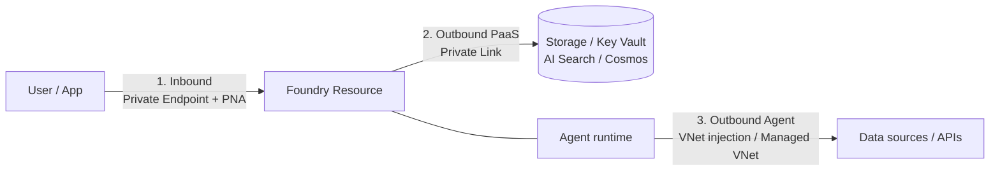

# Module 13: Network Isolation & Data Protection (45 min)

**Version:** 1.0
**Last Updated:** July 2026
**Format:** Led Demo (architecture + portal walkthrough; resources pre-provisioned)
**Prerequisite:** Module 1 complete (Foundry resource + project exist)

---

## Objective

Show how to keep the Contoso Estimator's traffic and data inside the enterprise boundary — private networking (inbound & outbound) plus encryption and data-residency controls — using Azure-native controls.

> **Why pre-provisioned:** private endpoints, VNet injection, and CMK take too long to create live. This module walks the **architecture and portal settings**; Bicep in [infra/](infra/) shows the shape of each control.

---

## Topics

### 13.1 Three areas of network isolation

Foundry considers isolation in three places:

| # | Area | Control |
|---|------|---------|
| 1 | **Inbound** to the Foundry resource | Private endpoint + **Public Network Access (PNA)** = Disabled |
| 2 | **Outbound (PaaS)** to dependencies | Private Link to Storage, Key Vault, AI Search, Cosmos DB |
| 3 | **Outbound (agent client)** to data/APIs | **VNet injection (BYO VNet, GA)** or **Managed VNet (preview)** |

📖 [Plan for network isolation in Foundry](https://learn.microsoft.com/azure/foundry/how-to/configure-private-link)

### 13.2 BYO VNet vs Managed VNet

| | **Custom VNet (BYO)** — GA | **Managed VNet** — Preview |
|---|---|---|
| Who runs it | You | Microsoft |
| Setup | Subnet delegated to `Microsoft.App/environments` (`/27`+); private endpoints to each dependency | Deployed via **Bicep only**; managed private endpoints |
| Egress control | NSG + your firewall/routes | Isolation mode: *Allow Internet* / *Allow Only Approved Outbound* / *Disabled* |
| Best for | Full control, custom routing | Simpler setup, guardrailed egress |
| Note | Requires **BYO** Storage/Search/Cosmos | **Cannot downgrade** isolation mode once set |

> Approved-outbound managed VNet supports FQDN rules on ports 80/443 via a managed Azure Firewall (extra cost). Australia East is a supported region.

📖 [Configure managed virtual network](https://learn.microsoft.com/azure/foundry/how-to/managed-virtual-network)

### 13.3 Tool traffic classes behind a VNet

Not every tool needs a private endpoint — know which traffic goes where:

| Traffic class | Tools | Networking needed |
|---------------|-------|-------------------|
| **Microsoft backbone** | Code Interpreter, Function Calling | None — stays on Microsoft network |
| **Private endpoint** | File Search (Storage), Azure AI Search, MCP to private resources | Private endpoint to the dependency |
| **Public endpoint** | Bing / Web Search, SharePoint | Public egress — **block with Azure Policy** if disallowed |

> For AI Search indexers traversing private endpoints, set the indexer `executionEnvironment` to `Private`, or indexing fails silently into an empty index.

### 13.4 Data storage & residency

| Setup | Where threads / files / vectors live |
|-------|--------------------------------------|
| **Basic agent** | Microsoft-managed multitenant storage (logical separation) |
| **Standard agent (BYO)** | **Your** Storage / Cosmos / Search — isolated **per project** |

Choose **standard/BYO** when data residency or "our data never leaves our subscription" is a requirement. Region selection + BYO resources keep data in-boundary.

📖 [Foundry architecture — data storage](https://learn.microsoft.com/azure/foundry/concepts/architecture#data-storage) · [Bring your own resources](https://learn.microsoft.com/azure/foundry/agents/how-to/use-your-own-resources)

### 13.5 Encryption & customer-managed keys (CMK)

By default all data at rest is encrypted with **Microsoft-managed keys** (FIPS 140-2, 256-bit AES) — no action needed. Use **CMK** for key control, rotation, revocation, and audit (double encryption).

CMK applies to data at rest in the Foundry resource's associated storage — **project artifacts, uploaded files, evaluation data**.

**Key Vault prerequisites for CMK:**

| Requirement | Detail |
|-------------|--------|
| Same region + tenant | Key Vault and Foundry resource (subscriptions may differ) |
| **Soft delete + purge protection** | Both enabled — else deleting the key makes data unrecoverable |
| Key type | RSA / RSA-HSM 2048 |
| Managed identity permission | **Key Vault Crypto User** (RBAC) — get / wrap / unwrap |
| Networking | Private endpoint **with** "Allow trusted Microsoft services", or trusted-services over public endpoint |

> ⚠️ CMK is available only in **select regions** (Azure AI Search capacity). Confirm regional availability before committing.

Portal: **Foundry resource → Encryption → Customer Managed Keys**.

📖 [Customer-managed keys for Foundry](https://learn.microsoft.com/azure/foundry/concepts/encryption-keys-portal)

---

## Demo

### Part A — Inbound isolation (portal, 10 min)

1. Foundry resource → **Networking** → set **Public network access** = **Disabled**.
2. **Private endpoint connections** → **+ Private endpoint** → target sub-resource `account`, into the demo VNet/subnet.
3. Show the auto-created **Private DNS zone** (`privatelink.cognitiveservices.azure.com`).
4. From a VM *outside* the VNet → portal/data-plane call fails. From *inside* → succeeds.

### Part B — Outbound & agent isolation (architecture, 10 min)

Walk the [infra/main.bicep](infra/main.bicep) private-endpoint block and the BYO-VNet vs Managed-VNet decision. Highlight the tool traffic-class table — Code Interpreter needs nothing; File Search needs a Storage private endpoint; Bing is public and can be **blocked by Azure Policy**.

### Part C — Data protection & CMK (portal + Bicep, 15 min)

1. Show **Encryption** blade → switch from Microsoft-managed to **Customer Managed Keys**.
2. Walk the Key Vault prerequisites in [infra/main.bicep](infra/main.bicep): purge protection ON, **Key Vault Crypto User** granted to the resource identity.
3. Rotate a key version in Key Vault → explain revocation/audit story.
4. Contrast **basic** (Microsoft-managed storage) vs **standard/BYO** (data in your subscription, per-project isolation) for residency.

---

## Pre-Demo Checklist

| # | Task | How | Verify |
|---|------|-----|--------|
| 1 | Demo VNet + subnet exist | `az network vnet list` | Subnet `/27`+ present |
| 2 | Foundry resource reachable | Module 1 | Project opens in portal |
| 3 | Key Vault with purge protection | `az keyvault show --query properties.enablePurgeProtection` | `true` |
| 4 | RSA-2048 key in Key Vault | `az keyvault key list` | Key present |
| 5 | You can edit Networking/Encryption | Role check | **Owner/Contributor** on resource |
| 6 | (Optional) VM inside + outside VNet | For the reachability contrast | One of each |
| 7 | Azure CLI + Bicep | `az bicep version` | Installed |

---

## Key Takeaways

- Isolate in **three** places: inbound, outbound-PaaS, outbound-agent.
- **BYO VNet** = control; **Managed VNet** = simplicity with guardrailed egress (can't downgrade).
- Know your **tool traffic classes** — private-endpoint some, block others with Azure Policy.
- **CMK** adds key control on top of default encryption; enforce **purge protection** and least-privilege **Key Vault Crypto User**.
- For residency, choose **standard/BYO** storage so data stays in your subscription, per project.

---

## Reference

| Topic | Link |
|-------|------|
| Network isolation (private link) | https://learn.microsoft.com/azure/foundry/how-to/configure-private-link |
| Managed virtual network | https://learn.microsoft.com/azure/foundry/how-to/managed-virtual-network |
| Customer-managed keys | https://learn.microsoft.com/azure/foundry/concepts/encryption-keys-portal |
| Foundry architecture (data storage) | https://learn.microsoft.com/azure/foundry/concepts/architecture |
| Bring your own resources | https://learn.microsoft.com/azure/foundry/agents/how-to/use-your-own-resources |
| Azure security baseline for Foundry | https://learn.microsoft.com/security/benchmark/azure/baselines/azure-ai-foundry-security-baseline |

> Deep dives: [docs/network-isolation-deep-dive.md](docs/network-isolation-deep-dive.md) · [docs/data-protection-cmk.md](docs/data-protection-cmk.md)
