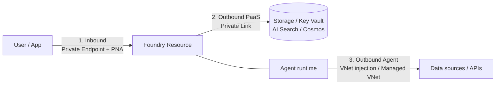

# Module 13: Network Isolation & Data Protection (45 min)

**Version:** 1.0
**Last Updated:** July 2026
**Format:** Led Demo (architecture + portal walkthrough; resources pre-provisioned)
**Prerequisite:** Module 1 complete (Foundry resource + project exist)

---

## Objective

Show how to keep the Contoso Estimator's traffic and data inside the enterprise boundary — private networking (inbound & outbound) plus encryption and data-residency controls — using Azure-native controls.

> **How we provision it:** rather than hand-rolling Bicep, this module deploys the **official Foundry sample — [Template 15: Standard Agent Setup with E2E Network Isolation](https://github.com/microsoft-foundry/foundry-samples/tree/main/infrastructure/infrastructure-setup-bicep/15-private-network-standard-agent-setup)**. It stands up a network-secured Foundry account + project, BYO Storage/Cosmos/AI Search behind private endpoints, agent-subnet VNet injection, and private telemetry (AMPLS) — the exact shape of each control we walk in this module. See [infra/](infra/) for the deploy/teardown wrappers.

> **Why pre-provisioned:** private endpoints, VNet injection, and the capability host take 15–25 min to create live. Deploy [infra/deploy.ps1](infra/deploy.ps1) **before** the session, then walk the **architecture and portal settings** against the running environment.

---

## Topics

### 13.1 Three areas of network isolation

Foundry considers isolation in three places:

| # | Area | Control |
|---|------|---------|
| 1 | **Inbound** to the Foundry resource | Private endpoint + **Public Network Access (PNA)** = Disabled |
| 2 | **Outbound (PaaS)** to dependencies | Private Link to Storage, Key Vault, AI Search, Cosmos DB |
| 3 | **Outbound (agent client)** to data/APIs | **VNet injection (BYO VNet, GA)** or **Managed VNet (preview)** |

📖 [Plan for network isolation in Foundry](https://learn.microsoft.com/azure/foundry/how-to/configure-private-link)

### 13.2 BYO VNet vs Managed VNet

| | **Custom VNet (BYO)** — GA | **Managed VNet** — Preview |
|---|---|---|
| Who runs it | You | Microsoft |
| Setup | Subnet delegated to `Microsoft.App/environments` (`/27`+); private endpoints to each dependency | Deployed via **Bicep only**; managed private endpoints |
| Egress control | NSG + your firewall/routes | Isolation mode: *Allow Internet* / *Allow Only Approved Outbound* / *Disabled* |
| Best for | Full control, custom routing | Simpler setup, guardrailed egress |
| Note | Requires **BYO** Storage/Search/Cosmos | **Cannot downgrade** isolation mode once set |

> Approved-outbound managed VNet supports FQDN rules on ports 80/443 via a managed Azure Firewall (extra cost). Australia East is a supported region.

> **This module's infra uses the Custom (BYO) VNet path** via [Template 15](https://github.com/microsoft-foundry/foundry-samples/tree/main/infrastructure/infrastructure-setup-bicep/15-private-network-standard-agent-setup) — full control with private endpoints to each BYO dependency.

📖 [Configure managed virtual network](https://learn.microsoft.com/azure/foundry/how-to/managed-virtual-network)

### 13.3 Tool traffic classes behind a VNet

Not every tool needs a private endpoint — know which traffic goes where:

| Traffic class | Tools | Networking needed |
|---------------|-------|-------------------|
| **Microsoft backbone** | Code Interpreter, Function Calling | None — stays on Microsoft network |
| **Private endpoint** | File Search (Storage), Azure AI Search, MCP to private resources | Private endpoint to the dependency |
| **Public endpoint** | Bing / Web Search, SharePoint | Public egress — **block with Azure Policy** if disallowed |

> For AI Search indexers traversing private endpoints, set the indexer `executionEnvironment` to `Private`, or indexing fails silently into an empty index.

### 13.4 Data storage & residency

| Setup | Where threads / files / vectors live |
|-------|--------------------------------------|
| **Basic agent** | Microsoft-managed multitenant storage (logical separation) |
| **Standard agent (BYO)** | **Your** Storage / Cosmos / Search — isolated **per project** |

Choose **standard/BYO** when data residency or "our data never leaves our subscription" is a requirement. Region selection + BYO resources keep data in-boundary.

📖 [Foundry architecture — data storage](https://learn.microsoft.com/azure/foundry/concepts/architecture#data-storage) · [Bring your own resources](https://learn.microsoft.com/azure/foundry/agents/how-to/use-your-own-resources)

### 13.5 Encryption & customer-managed keys (CMK)

By default all data at rest is encrypted with **Microsoft-managed keys** (FIPS 140-2, 256-bit AES) — no action needed. Use **CMK** for key control, rotation, revocation, and audit (double encryption).

CMK applies to data at rest in the Foundry resource's associated storage — **project artifacts, uploaded files, evaluation data**.

**Key Vault prerequisites for CMK:**

| Requirement | Detail |
|-------------|--------|
| Same region + tenant | Key Vault and Foundry resource (subscriptions may differ) |
| **Soft delete + purge protection** | Both enabled — else deleting the key makes data unrecoverable |
| Key type | RSA / RSA-HSM 2048 |
| Managed identity permission | **Key Vault Crypto User** (RBAC) — get / wrap / unwrap |
| Networking | Private endpoint **with** "Allow trusted Microsoft services", or trusted-services over public endpoint |

> ⚠️ CMK is available only in **select regions** (Azure AI Search capacity). Confirm regional availability before committing.

Portal: **Foundry resource → Encryption → Customer Managed Keys**.

📖 [Customer-managed keys for Foundry](https://learn.microsoft.com/azure/foundry/concepts/encryption-keys-portal)

---

## Demo

> The environment is stood up ahead of time by [infra/deploy.ps1](infra/deploy.ps1), which deploys **Foundry sample Template 15**. Walk the running resources in the portal; the parameter shape lives in [infra/main.bicepparam](infra/main.bicepparam).

### Part A — Inbound isolation (portal, 10 min)

1. Open the **network-secured Foundry resource** → **Networking** → confirm **Public network access = Disabled**.
2. **Private endpoint connections** → show the endpoint into the **pe-subnet** (sub-resource `account`).
3. Show the auto-created **Private DNS zones** (`privatelink.cognitiveservices.azure.com`, `privatelink.openai.azure.com`, `privatelink.services.ai.azure.com`).
4. From a VM/jump box *inside* the VNet → the resource resolves to a private IP and data-plane calls succeed. From *outside* → DNS/portal data-plane call fails.

### Part B — Outbound & agent isolation (architecture + portal, 12 min)

Walk what Template 15 wired up:

1. **VNet** (`192.168.0.0/16`) with two subnets — the **agent-subnet** delegated to `Microsoft.App/environments` (VNet injection for the agent runtime) and the **pe-subnet** hosting private endpoints.
2. **Private endpoints** to each BYO dependency — **Storage**, **Cosmos DB**, **AI Search** — each with its own private DNS zone.
3. **Azure Monitor Private Link Scope (AMPLS)** — hosted agents export telemetry to Application Insights/Log Analytics over the private network (public ingestion disabled).
4. Tie back to the **tool traffic-class table** (13.3): Code Interpreter needs nothing; File Search rides the Storage private endpoint; Bing is public and can be **blocked by Azure Policy**.

> Template 15 does **not** put agent *tools* (MCP, OpenAPI, Functions, A2A) behind the VNet — that's [Template 19](https://github.com/microsoft-foundry/foundry-samples/tree/main/infrastructure/infrastructure-setup-bicep/19-private-network-agent-tools).

### Part C — Data residency: standard agent + BYO (portal, 10 min)

1. Open the project's **connections** — Storage, Cosmos DB, AI Search all point at **your** subscription's resources (AAD auth, no keys).
2. Explain where agent state lives: **threads/messages → Cosmos DB**, **files → Storage**, **vector stores → AI Search** — isolated **per project** inside your boundary.
3. Contrast **basic** (Microsoft-managed multitenant storage) vs **standard/BYO** (this deployment) for "our data never leaves our subscription".

### Part D — Encryption & CMK (portal, 8 min — optional add-on)

Template 15 encrypts at rest with **Microsoft-managed keys** by default. For key control:

1. Foundry resource → **Encryption** blade → switch to **Customer Managed Keys**.
2. Requires a Key Vault with **soft delete + purge protection**, an **RSA-2048** key, and **Key Vault Crypto User** granted to the resource identity (get/wrap/unwrap).
3. Rotate a key version → explain the revocation/audit story. See [docs/data-protection-cmk.md](docs/data-protection-cmk.md).

---

## Pre-Demo Checklist

| # | Task | How | Verify |
|---|------|-----|--------|
| 1 | Resource providers registered | `az provider register --namespace Microsoft.App` (+ CognitiveServices, Search, Storage, Network, ContainerService) | `Registered` |
| 2 | Template 15 environment deployed | `./infra/deploy.ps1 -ResourceGroup rg-contoso-foundry-secured` | Deployment succeeds (~15–25 min) |
| 3 | Foundry resource is private | Portal → Networking | Public network access **Disabled** |
| 4 | Private endpoints healthy | `az network private-endpoint list -g rg-contoso-foundry-secured` | Foundry + Storage + Cosmos + Search present |
| 5 | Agent subnet delegated | `az network vnet subnet show --vnet-name vnet-contoso-secured -n agent-subnet` | Delegated to `Microsoft.App/environments` |
| 6 | Jump box / VPN / Bastion into the VNet | For the inside-vs-outside reachability contrast | Private IP resolves inside |
| 7 | (Part D) Key Vault w/ purge protection + RSA-2048 key | `az keyvault show --query properties.enablePurgeProtection` | `true` |
| 8 | Azure CLI + git | `az version`; `git --version` | Installed |

---

## Key Takeaways

- Isolate in **three** places: inbound (PNA + PE), outbound-PaaS (PE to BYO Storage/Cosmos/Search), outbound-agent (agent-subnet VNet injection).
- **Template 15** is the maintained reference for BYO-VNet E2E isolation — use it instead of hand-rolled Bicep; **Template 19** adds tools behind the VNet, **Template 18** is Managed VNet.
- Know your **tool traffic classes** — private-endpoint some, block others with Azure Policy.
- **Standard/BYO** keeps threads (Cosmos), files (Storage), and vectors (Search) in your subscription, per project — the data-residency story.
- **CMK** layers key control on top of default encryption; enforce **purge protection** and least-privilege **Key Vault Crypto User**.
- Teardown must **purge** the account so the delegated agent subnet unlinks — see [infra/teardown.ps1](infra/teardown.ps1).

---

## Reference

| Topic | Link |
|-------|------|
| Template 15 — E2E network isolation (this module's infra) | https://github.com/microsoft-foundry/foundry-samples/tree/main/infrastructure/infrastructure-setup-bicep/15-private-network-standard-agent-setup |
| Template 19 — tools behind the VNet | https://github.com/microsoft-foundry/foundry-samples/tree/main/infrastructure/infrastructure-setup-bicep/19-private-network-agent-tools |
| Network isolation (private link) | https://learn.microsoft.com/azure/foundry/how-to/configure-private-link |
| Managed virtual network | https://learn.microsoft.com/azure/foundry/how-to/managed-virtual-network |
| Customer-managed keys | https://learn.microsoft.com/azure/foundry/concepts/encryption-keys-portal |
| Foundry architecture (data storage) | https://learn.microsoft.com/azure/foundry/concepts/architecture |
| Bring your own resources | https://learn.microsoft.com/azure/foundry/agents/how-to/use-your-own-resources |
| Azure security baseline for Foundry | https://learn.microsoft.com/security/benchmark/azure/baselines/azure-ai-foundry-security-baseline |

> Deep dives: [docs/network-isolation-deep-dive.md](docs/network-isolation-deep-dive.md) · [docs/data-protection-cmk.md](docs/data-protection-cmk.md)
